# 前言

最近一直想要跳槽，在刷招聘网站的时候发现现在大多数岗位都要求会使用WPF，damn，这一节我们就来学习如何使用WPF；

# 学习路线

## 生命周期

WPF应用的生命周期对应四个Application的函数，`OnStartup`启动应用，`OnActivated`激活应用，`OnDeactivated`失去激活，`OnExit`退出应用，我们可以在`Application`输出日志查看：

```csharp
using System;
using System.Windows;

namespace WPFDemo
{
    /// <summary>
    /// App.xaml 的交互逻辑
    /// </summary>
    public partial class App : Application
    {
        protected override void OnStartup(StartupEventArgs e)
        {
            base.OnStartup(e);
            Log.i("OnStartup");
        }

        protected override void OnActivated(EventArgs e)
        {
            base.OnActivated(e);
            Log.i("OnActivated");
        }

        protected override void OnDeactivated(EventArgs e)
        {
            base.OnDeactivated(e);
            Log.i("OnDeactivated");
        }

        protected override void OnExit(ExitEventArgs e)
        {
            base.OnExit(e);
            Log.i("OnExit");
        }
    }
}
```

<div align='center'>

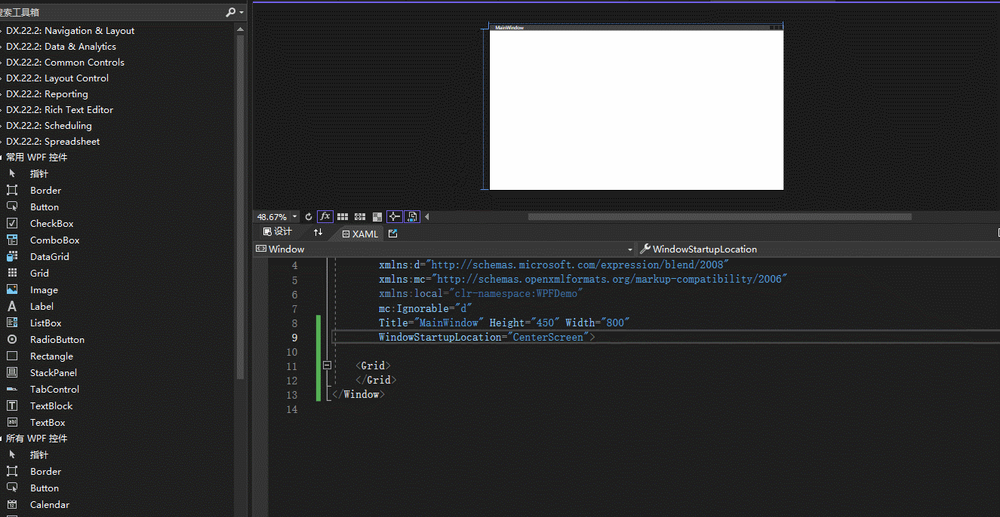
</div>


而窗体的生命周期我们同样也日志输出一下：
```csharp
using System;
using System.Runtime.CompilerServices;
using System.Threading.Tasks;
using System.Windows;

namespace WPFDemo
{
    /// <summary>
    /// MainWindow.xaml 的交互逻辑
    /// </summary>
    public partial class MainWindow : Window
    {
        public MainWindow()
        {
            InitializeComponent();

            this.SourceInitialized += (s, e) => Log.i("SourceInitialized");

            this.Activated += (s, e) => Log.i("Activated");

            this.Loaded += (s, e) => Log.i("Loaded");

            this.ContentRendered += (s, e) => Log.i("ContentRendered");

            this.Deactivated += (s, e) => Log.i("Deactivated");

            this.Closing += (s, e) => Log.i("Closing");

            this.Closed += (s, e) => Log.i("Closed");

            this.Unloaded += (s, e) => Log.i("Unloaded");
        }
    }
}
```


<div align='center'>

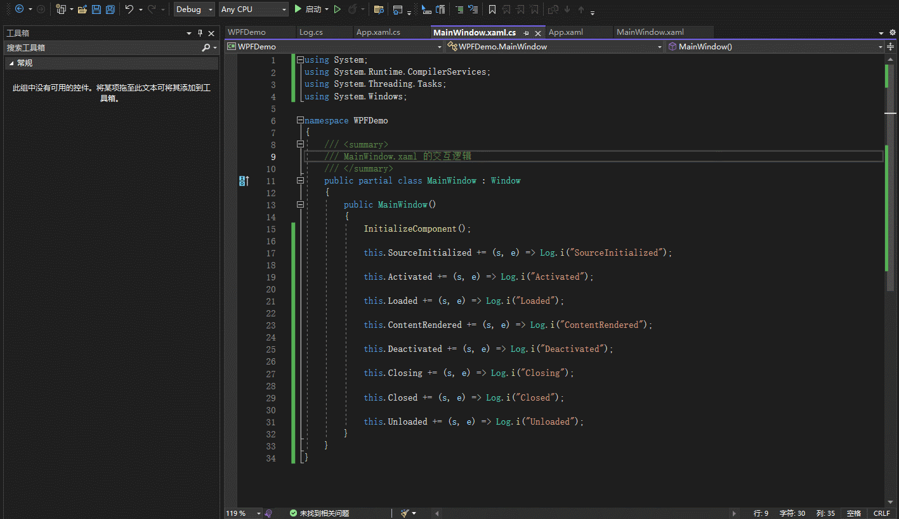
</div>


它对应的含义如下所示：
<div align='center'>

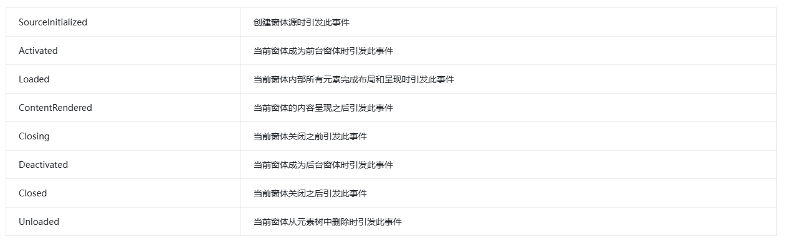
</div>


## 控件模板

控件模板（ControlTemplate），它定义控件的外观，如果我们不想要控件本身的样式的时候，我们就可以使用控件模板写出我们自己想要的，例如`Button`，我们希望它是圆角的形式，我们就可以使用控件模板：
<div align='center'>


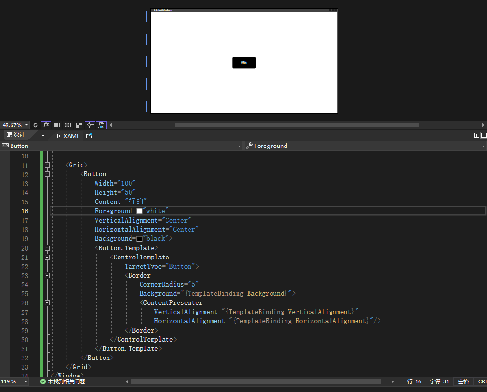
</div>


我们使用`Border`装饰控件外观，在`Border`的子控件有一个`ContentPresenter`对象，它其实就是相当于控件的内容，这里就是等于`Buttont.Content`；

在控件模板中我们为属性赋值的时候，有些地方没有写固定值，而是使用`{TemplateBinding Background}`类似这样的形式，它被称为模板绑定，它属性值是由外部赋予的，增加了动态性；


## 数据模板

数据模板（DataTemplate），它定义数据的表现形式，它在列表控件中可以去定义子项数据的呈现形式；

这里有一个`DownloadTask`：
```csharp
using System;
using System.IO;

namespace WPFDemo.Model
{
    public class DownloadTask
    {
        /// <summary>
        /// Id
        /// </summary>
        public Guid Id { get; set; }

        /// <summary>
        /// 路径
        /// </summary>
        public string FilePath { get; set; }

        /// <summary>
        /// 进度
        /// </summary>
        public double Rate { get; set; }
        
        /// <summary>
        /// 提示信息
        /// </summary>
        public string Message { get; set; }

        /// <summary>
        /// 是否成功
        /// </summary>
        public bool Success { get; set; }

        /// <summary>
        /// 文件名称
        /// </summary>
        public string Name => Path.GetFileName(FilePath);
    }
}

```

我们在页面上放一个`ListBox`：
```csharp
<Window x:Class="WPFDemo.MainWindow"
        xmlns="http://schemas.microsoft.com/winfx/2006/xaml/presentation"
        xmlns:x="http://schemas.microsoft.com/winfx/2006/xaml"
        xmlns:d="http://schemas.microsoft.com/expression/blend/2008"
        xmlns:mc="http://schemas.openxmlformats.org/markup-compatibility/2006"
        xmlns:local="clr-namespace:WPFDemo"
        mc:Ignorable="d"
        Title="MainWindow" Height="450" Width="800"
        WindowStartupLocation="CenterScreen">
    
    <Grid>
        <ListBox Name="listbox"/>
    </Grid>
</Window>
```

然后在后台为它赋值：
```csharp
using System.Collections.Generic;
using System.Windows;
using WPFDemo.Model;

namespace WPFDemo
{
    /// <summary>
    /// MainWindow.xaml 的交互逻辑
    /// </summary>
    public partial class MainWindow : Window
    {
        public MainWindow()
        {
            InitializeComponent();

            var list = new List<DownloadTask>()
            {
                new DownloadTask()
                {
                    FilePath = "D://Downloads//test_file1.docx"
                },
                new DownloadTask()
                {
                    FilePath = "D://Downloads//test_file2.docx"
                },
            };

            listbox.ItemsSource = list;
        }
    }
}
```

它的效果是这样子的：
<div align='center'>

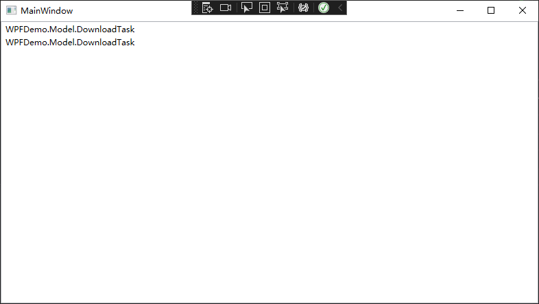
</div>

什么都没有，因为它显示子项时默认调用`ToString()`，也就是`WPFDemo.Model.Person`的文字，如果我们想要显示出名称，我们设置`ListBox.DisplayMemberPath`属性：
```csharp
<ListBox Name="listbox" DisplayMemberPath="Name"/>
```

<div align='center'>

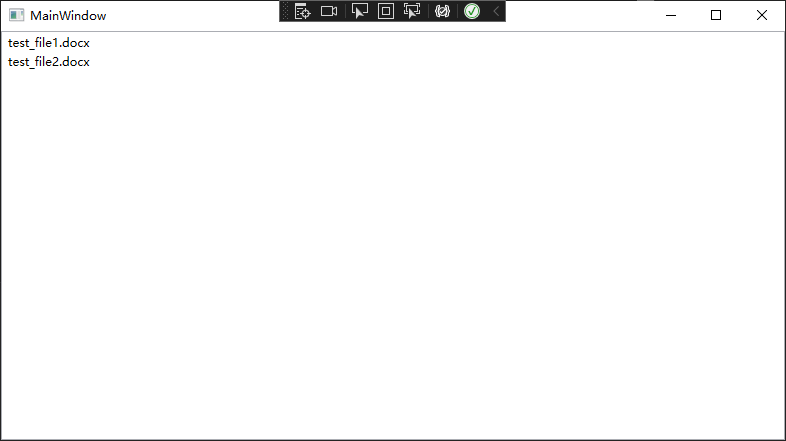
</div>


当我们需要自定义子项显示时则需要用到数据模板：
```csharp
<Window x:Class="WPFDemo.MainWindow"
        xmlns="http://schemas.microsoft.com/winfx/2006/xaml/presentation"
        xmlns:x="http://schemas.microsoft.com/winfx/2006/xaml"
        xmlns:d="http://schemas.microsoft.com/expression/blend/2008"
        xmlns:mc="http://schemas.openxmlformats.org/markup-compatibility/2006"
        xmlns:local="clr-namespace:WPFDemo"
        mc:Ignorable="d"
        Title="MainWindow" Height="450" Width="800"
        WindowStartupLocation="CenterScreen">

    <Grid>
        <ListBox 
            Name="listbox">
            <ListBox.ItemTemplate>
                <DataTemplate>
                    <Grid Cursor="Hand">
                        <Grid.ColumnDefinitions>
                            <ColumnDefinition/>
                            <ColumnDefinition/>
                            <ColumnDefinition/>
                            <ColumnDefinition/>
                        </Grid.ColumnDefinitions>

                        <Image Source="/icons8-microsoft-word-2019-48.png" Width="28" Height="28" Grid.Row="0" Grid.Column="0"/>

                        <StackPanel Orientation="Vertical" Grid.Row="0" Grid.Column="1" Margin="10">
                            <TextBlock Text="{Binding Name}" FontSize="14"/>
                            <TextBlock Text="打开文件" FontSize="10" Margin="0 5 0 0" Foreground="#006fc4">
                                <TextBlock.TextDecorations>
                                    <TextDecorationCollection>
                                        <TextDecoration PenOffset="3"/>
                                    </TextDecorationCollection>
                                </TextBlock.TextDecorations>
                            </TextBlock>
                        </StackPanel>

                    </Grid>
                </DataTemplate>
            </ListBox.ItemTemplate>
        </ListBox>
    </Grid>
</Window>
```

显示效果如下所示：
<div align='center'>

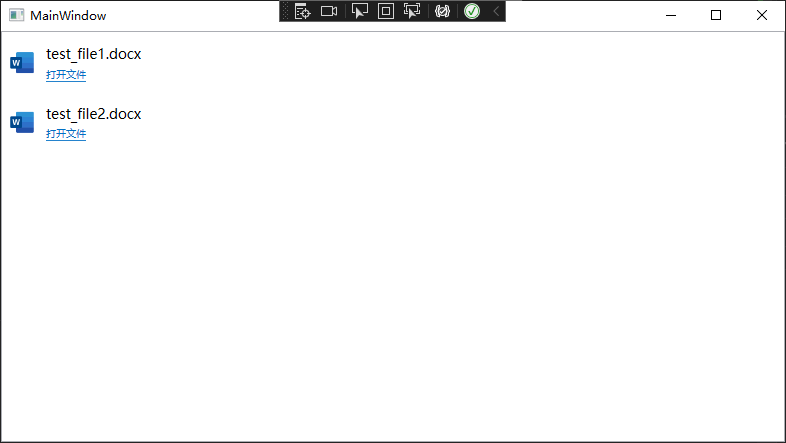
</div>

## 触发器

WPF中的触发器可以去监听属性，值，事件达到满足条件后去改变元素样式，它有下面五种类型：

<div align='center'>

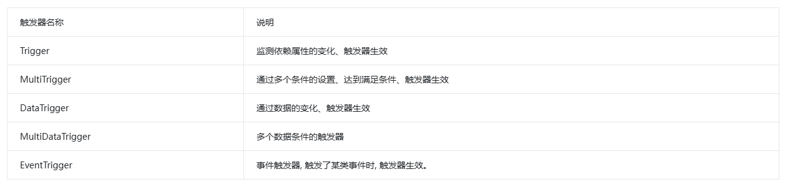
</div>

我们根据需要去使用对应的触发器，这里以第一种为示例：
```csharp
<Window x:Class="WPFDemo.MainWindow"
        xmlns="http://schemas.microsoft.com/winfx/2006/xaml/presentation"
        xmlns:x="http://schemas.microsoft.com/winfx/2006/xaml"
        xmlns:d="http://schemas.microsoft.com/expression/blend/2008"
        xmlns:mc="http://schemas.openxmlformats.org/markup-compatibility/2006"
        xmlns:local="clr-namespace:WPFDemo"
        mc:Ignorable="d"
        Title="MainWindow" Height="450" Width="400"
        WindowStartupLocation="CenterScreen">

    <Grid>
        <ListBox 
            Name="listbox">
            <ListBox.ItemContainerStyle>
                <Style TargetType="ListBoxItem">
                    <Setter Property="Template">
                        <Setter.Value>
                            <ControlTemplate TargetType="ListBoxItem">
                                <ContentPresenter/>
                            </ControlTemplate>
                        </Setter.Value>
                    </Setter>
                </Style>
            </ListBox.ItemContainerStyle>
            <ListBox.ItemTemplate>
                <DataTemplate>
                    <Grid x:Name="item_box" Cursor="Hand" Margin="10 0 10 0">
                        <Grid.ColumnDefinitions>
                            <ColumnDefinition Width="28"/>
                            <ColumnDefinition/>
                            <ColumnDefinition Width="28"/>
                            <ColumnDefinition Width="48"/>
                        </Grid.ColumnDefinitions>

                        <Image Source="/icons8-microsoft-word-2019-48.png" Width="28" Height="28" Grid.Row="0" Grid.Column="0"/>

                        <StackPanel Orientation="Vertical" Grid.Row="0" Grid.Column="1" Margin="10">
                            <TextBlock Text="{Binding Name}" FontSize="14"/>
                            <TextBlock Text="打开文件" FontSize="10" Margin="0 5 0 0" Foreground="#006fc4">
                                <TextBlock.TextDecorations>
                                    <TextDecorationCollection>
                                        <TextDecoration PenOffset="3"/>
                                    </TextDecorationCollection>
                                </TextBlock.TextDecorations>
                            </TextBlock>
                        </StackPanel>

                        <Image x:Name="btn_folder" Visibility="Collapsed" Source="/icons8-folder-50.png" Width="28" Height="28" Grid.Row="0" Grid.Column="2"/>

                        <Image x:Name="btn_delete" Visibility="Collapsed" Source="/icons8-trash-can-50.png" Width="28" Height="28" Grid.Row="0" Grid.Column="3" Margin="10 0 10 0"/>
                    </Grid>

                    <DataTemplate.Triggers>
                        <Trigger Property="IsMouseOver" Value="true">
                            <Setter TargetName="btn_folder" Property="Visibility" Value="Visible"/>
                            <Setter TargetName="btn_delete" Property="Visibility" Value="Visible"/>
                            <Setter TargetName="item_box" Property="Background" Value="#f2f2f2"/>
                        </Trigger>
                    </DataTemplate.Triggers>
                </DataTemplate>
            </ListBox.ItemTemplate>
        </ListBox>
    </Grid>
</Window>
```


<div align='center'>

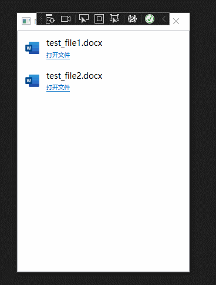
</div>

鼠标在经过item时会显示按钮以及修改背景色，在离开后恢复；

## 数据绑定

什么是MVVM模式，M-Model，V-View，VM-ViewModel，在Model-View之间增加了ViewModel层，它实现了双向绑定，当修改View层时更新Model以及修改Model时更新View；

在View层，使用`Binding`来绑定ViewModel中的属性，`ViewModel`需要实现`INotifyPropertyChanged`的接口，但属性修改的时候需要调用`PropertyChangedEventHandler`通知View层我这个属性修改了你要去更新；

`Binding`除了绑定ViewModel，还能绑定View上的信息；可以通过(1)Source/Path绑定资源对象属性，(2)ElementName/Path绑定元素属性；

我们实现下面的效果：

<div align='center'>


</div>

这里先贴上代码：

ObservableObject.cs
```csharp
using System.ComponentModel;
using System.Runtime.CompilerServices;

namespace WPFDemo.Model
{
    public class ObservableObject : INotifyPropertyChanged
    {
        public event PropertyChangedEventHandler PropertyChanged;

        public void RaisePropertyChanged([CallerMemberName] string propertyName = "")
        {
            PropertyChanged?.Invoke(this, new PropertyChangedEventArgs(propertyName));
        }
    }
}
```

DownloadTask.cs
```csharp
using System;
using System.IO;
using System.Windows;

namespace WPFDemo.Model
{
    public class DownloadTask: ObservableObject
    {
        /// <summary>
        /// Id
        /// </summary>
        public Guid Id { get; set; }

        /// <summary>
        /// 路径
        /// </summary>
        public string FilePath { get; set; }

        /// <summary>
        /// 进度
        /// </summary>
        private double rate
        {
            get; set;
        }

        /// <summary>
        /// 进度
        /// </summary>
        public double Rate
        {
            get { return rate; }
            set { rate = value; RaisePropertyChanged(); }
        }

        /// <summary>
        /// 提示消息
        /// </summary>
        private string message { get; set; }

        /// <summary>
        /// 提示信息
        /// </summary>
        public string Message 
        {
            get => message;
            set { message = value;RaisePropertyChanged(); }
        }

        /// <summary>
        /// 是否下载中
        /// </summary>
        private bool downloading { get; set; }

        /// <summary>
        /// 是否下载中
        /// </summary>
        public bool Downloading
        {
            get => downloading;
            set { downloading = value; RaisePropertyChanged(); }
        }

        /// <summary>
        /// 是否成功
        /// </summary>
        private bool success { get; set; }

        /// <summary>
        /// 是否成功
        /// </summary>
        public bool Success
        {
            get { return success; }
            set {
                success = value;
                RaisePropertyChanged();

                if(success)
                {
                    RateVisibility = Visibility.Collapsed;
                    SuccessVisibility = Visibility.Visible;
                }
            }
        }

        /// <summary>
        /// 文件名称
        /// </summary>
        public string Name => Path.GetFileName(FilePath);

        /// <summary>
        /// 成功显示
        /// </summary>
        private Visibility successVisibility { get; set; }

        /// <summary>
        /// 成功显示
        /// </summary>
        public Visibility SuccessVisibility 
        {
            get => successVisibility;
            set
            {
                successVisibility = value;
                RaisePropertyChanged();
            }
        }

        /// <summary>
        /// 进度显示
        /// </summary>
        public Visibility rateVisibility { get; set; }

        /// <summary>
        /// 进度显示
        /// </summary>
        public Visibility RateVisibility
        {
            get => rateVisibility;
            set
            {
                rateVisibility = value;
                RaisePropertyChanged();
            }
        }
    }
}
```

MainViewModel.cs
```csharp
using System.Collections.ObjectModel;
using WPFDemo.Model;

namespace WPFDemo.ViewModel
{
    public class MainViewModel:ObservableObject
    {
        public ObservableCollection<DownloadTask> DownloadTasks { get; set; }
    }
}
```

MainWindow.xaml
```csharp
<Window x:Class="WPFDemo.MainWindow"
        xmlns="http://schemas.microsoft.com/winfx/2006/xaml/presentation"
        xmlns:x="http://schemas.microsoft.com/winfx/2006/xaml"
        xmlns:d="http://schemas.microsoft.com/expression/blend/2008"
        xmlns:mc="http://schemas.openxmlformats.org/markup-compatibility/2006"
        xmlns:local="clr-namespace:WPFDemo"
        mc:Ignorable="d"
        Title="MainWindow" Height="450" Width="400"
        WindowStartupLocation="CenterScreen">

    <Grid>
        <ListBox 
            Name="listbox"
            ItemsSource="{Binding DownloadTasks}">
            <ListBox.ItemContainerStyle>
                <Style TargetType="ListBoxItem">
                    <Setter Property="Template">
                        <Setter.Value>
                            <ControlTemplate TargetType="ListBoxItem">
                                <ContentPresenter/>
                            </ControlTemplate>
                        </Setter.Value>
                    </Setter>
                </Style>
            </ListBox.ItemContainerStyle>
            <ListBox.ItemTemplate>
                <DataTemplate>
                    <Grid x:Name="item_box" Cursor="Hand" Margin="10 0 10 0" Height="80">
                        <Grid.ColumnDefinitions>
                            <ColumnDefinition Width="28"/>
                            <ColumnDefinition/>
                            <ColumnDefinition Width="Auto"/>
                        </Grid.ColumnDefinitions>

                        <Image Source="/icons8-microsoft-word-2019-48.png" Width="28" Height="28" Grid.Row="0" Grid.Column="0"/>

                        <StackPanel Orientation="Vertical" Grid.Row="0" Grid.Column="1" Margin="10">
                            <TextBlock Text="{Binding Name}" FontSize="15" Margin="0 10 0 0"/>
                            <TextBlock Text="打开文件" FontSize="10" Margin="0 5 0 0" Foreground="#006fc4" Visibility="{Binding SuccessVisibility}">
                                <TextBlock.TextDecorations>
                                    <TextDecorationCollection>
                                        <TextDecoration PenOffset="3"/>
                                    </TextDecorationCollection>
                                </TextBlock.TextDecorations>
                            </TextBlock>
                            <StackPanel Orientation="Vertical" Visibility="{Binding RateVisibility}">
                                <ProgressBar Margin="0 10 0 0" Value="{Binding Rate}"/>
                                <TextBlock Margin="0 3 0 0" Text="{Binding Message, StringFormat=提示: {0}}" x:Name="tb_tip"/>
                            </StackPanel>
                        </StackPanel>

                        <StackPanel Orientation="Horizontal"  Grid.Row="0" Grid.Column="2" Visibility="Collapsed" x:Name="box_edit">
                            <Image x:Name="btn_folder" Source="/icons8-folder-50.png" Width="28" Height="28" Margin="10 0 10 0"/>
                            <Image x:Name="btn_delete" Source="/icons8-trash-can-50.png" Width="28" Height="28"  Margin="10 0 10 0"/>
                        </StackPanel>
                    </Grid>

                    <DataTemplate.Triggers>
                        <MultiDataTrigger>
                            <MultiDataTrigger.Conditions>
                                <Condition Binding="{Binding Success}" Value="True"/>
                                <Condition Binding="{Binding RelativeSource={RelativeSource Mode=Self}, Path=IsMouseOver}" Value="True"/>
                            </MultiDataTrigger.Conditions>
                            <MultiDataTrigger.Setters>
                                <Setter TargetName="box_edit" Property="Visibility" Value="Visible"/>
                                <Setter TargetName="item_box" Property="Background" Value="#f2f2f2"/>
                            </MultiDataTrigger.Setters>
                        </MultiDataTrigger>

                        <MultiDataTrigger>
                            <MultiDataTrigger.Conditions>
                                <Condition Binding="{Binding Success}" Value="False"/>
                                <Condition Binding="{Binding Downloading}" Value="False"/>
                            </MultiDataTrigger.Conditions>
                            <MultiDataTrigger.Setters>
                                <Setter TargetName="tb_tip" Property="Foreground" Value="Red"/>
                            </MultiDataTrigger.Setters>
                        </MultiDataTrigger>
                    </DataTemplate.Triggers>
                </DataTemplate>
            </ListBox.ItemTemplate>
        </ListBox>
    </Grid>
</Window>
```


MainWindow.xaml.cs
```csharp
using System;
using System.Collections.ObjectModel;
using System.Threading.Tasks;
using System.Windows;
using WPFDemo.Model;
using WPFDemo.ViewModel;

namespace WPFDemo
{
    /// <summary>
    /// MainWindow.xaml 的交互逻辑
    /// </summary>
    public partial class MainWindow : Window
    {

        private readonly MainViewModel _model;

        public MainWindow()
        {
            InitializeComponent();

            _model = new MainViewModel()
            {
                DownloadTasks = new ObservableCollection<DownloadTask>()
            };

            this.DataContext= _model;

            Task.Factory.StartNew(async () =>
            {
                await Task.Delay(1000);

                var task = new DownloadTask()
                {
                    Id = Guid.NewGuid(),
                    FilePath = "D://Downloads//test_file1.docx",
                    SuccessVisibility = Visibility.Collapsed,
                    RateVisibility = Visibility.Visible,
                    Downloading = true,
                };

                listbox.Dispatcher.Invoke(() => _model.DownloadTasks.Add(task));

                while (task.Rate != 100)
                {
                    listbox.Dispatcher.Invoke(() =>
                    {
                        task.Rate += 1;
                        task.Message = $"{task.Rate}%";
                    });
                    
                    await Task.Delay(50);
                }
                listbox.Dispatcher.Invoke(() =>
                {
                    task.Success = true;
                    task.Downloading = false;
                });
            });

            Task.Factory.StartNew(async () =>
            {

                DownloadTask task = null;
                try
                {
                    await Task.Delay(1500);

                    task = new DownloadTask()
                    {
                        Id = Guid.NewGuid(),
                        FilePath = "D://Downloads//test_file2.docx",
                        SuccessVisibility = Visibility.Collapsed,
                        RateVisibility = Visibility.Visible,
                        Downloading= true,
                    };

                    listbox.Dispatcher.Invoke(() => _model.DownloadTasks.Add(task));

                    while (task.Rate != 100)
                    {
                        listbox.Dispatcher.Invoke(() =>
                        {
                            task.Rate += 1;
                            task.Message = $"{task.Rate}%";
                        });

                        if(task.Rate == 50)
                        {
                            throw new Exception("模拟错误");
                        }

                        await Task.Delay(50);
                    }
                    listbox.Dispatcher.Invoke(() =>
                    {
                        task.Success = true;
                        task.Downloading = false;
                    });
                }
                catch(Exception e)
                {

                    if(task != null)
                    {
                        listbox.Dispatcher.Invoke(() =>
                        {
                            task.Success = false;
                            task.Message = e.Message;
                            task.Downloading = false;
                        });
                    }
                }
                
            });
        }
    }
}
```


在这个实现效果中有一个需求，就是必须在下载完成状态以及鼠标经过时，才显示打开目录&删除的按钮，这是我们需要用到触发器去监听属性值；

如果需要监听ViewModel中的属性值是需要用到`DataTrigger`，我们可以很轻松的就绑定上ViewModel中的属性；

鼠标经过是`IsMouseOver`属性，它一般是用在`Trigger`触发器，而监听ViewModel中的属性是用到`DataTrigger`，在WPF是不能混用的，但我们仍然可以在`DataTrigger`上监听到`IsMouseOver`的值；

```csharp
<MultiDataTrigger>
    <MultiDataTrigger.Conditions>
        ...
        <Condition Binding="{Binding RelativeSource={RelativeSource Mode=Self}, Path=IsMouseOver}" Value="True"/>
    </MultiDataTrigger.Conditions>
    ...
</MultiDataTrigger>
```

`RelativeSource`是绑定相对的数据源，它有下面四种：

<div align='center'>


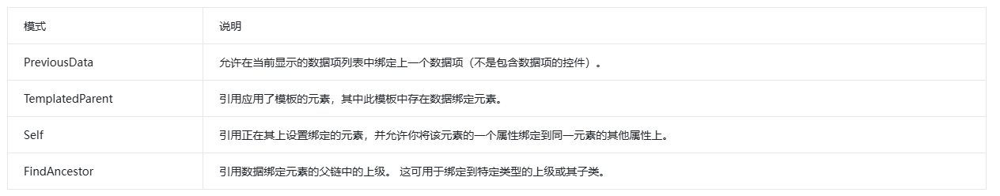
</div>

我们使用的是`Self`，也就是绑定当前UI元素的`IsMouseOver`属性值，这样我们就通过`DataTrigger`完成对UI元素属性的绑定了；


## 命令

在学习WPF的命令之前，我们需要先了解设计模式中的命令模式，这里主要围绕“命令和我直接写一个方法有什么区别”进行学习：

1. 封装：命令它是将操作封装成了一个对象，里面包含操作的所有信息。而方法是定义在类里的，依赖于类的状态与属性。

2. 解耦：调用方法需要指定对象，而命令不需要；

3. 命令模式可以实现操作的“撤销”&“恢复”，因为在命令对象中可以保存数据，撤销往往是与原命令相反的操作，而恢复(重做)则是重新执行操作，而单独写方法需要额外的逻辑实现；

4. 命令对象可以被存储到队列或者其他集合数据结构中，用于记录历史操作，用于记录历史操作或其他需求，而方法不具备这样的功能；

下面我们再来看看命令模式的结构图：

<div align='center'>

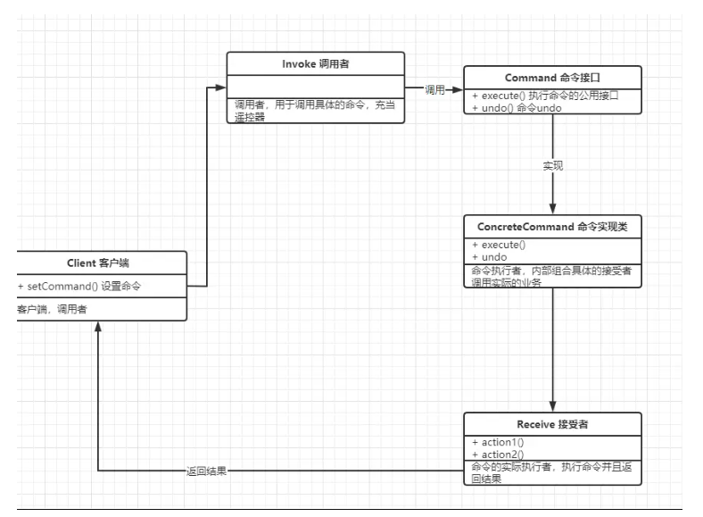
</div>

它这里有这几个角色：

client:用户

invoker:调用者

comcrete_command:命令

receiver:接收者


我们以用餐为例：客户(client)到店吃饭时需要向服务员(invoker)点餐，服务员会将客户想吃的菜写在纸上(comcrete_command)，点完餐后服务员就会将纸加入在厨房的等待制作列表中，当列表前面的饭菜都制作完毕排到自己时，就会通知厨师(receiver)开始制作；

下面我们再来看看WPF中的命令，WPF的命令都需要实现`ICommand`接口，我们实现一个：

```csharp
using System;
using System.Windows;
using System.Windows.Input;

namespace WPFDemo.Command
{
    public class HelloCommand : ICommand
    {
        event EventHandler ICommand.CanExecuteChanged
        {
            add
            {
                CommandManager.RequerySuggested += value;
            }

            remove
            {
                CommandManager.RequerySuggested -= value;
            }
        }

        bool ICommand.CanExecute(object parameter)
        {
            return true;
        }

        void ICommand.Execute(object parameter)
        {
            MessageBox.Show("Hello,World!");
        }
    }
}
```

1. `CanExecute`：命令能否被执行；

2. `Execute` ：命令执行；

3. `CanExecuteChanged`：通知绑定目标命令可执行状态是否发生改变，当我们添加移除事件时实际是使用`CommandManager.RequerySuggested`的静态事件，`CommandManager.RequerySuggested`事件被触发的时候，WPF会评估所有命令的可执行性，也就是会调用`CanExecute()`，如果它的返回值发生改变时就会调用`CanExecuteChanged`；


我们在页面上增加一个按钮并绑定命令：
```csharp
<Window x:Class="WPFDemo.MainWindow"
        xmlns="http://schemas.microsoft.com/winfx/2006/xaml/presentation"
        xmlns:x="http://schemas.microsoft.com/winfx/2006/xaml"
        xmlns:d="http://schemas.microsoft.com/expression/blend/2008"
        xmlns:mc="http://schemas.openxmlformats.org/markup-compatibility/2006"
        xmlns:local="clr-namespace:WPFDemo"
        xmlns:cmd="clr-namespace:WPFDemo.Command"
        mc:Ignorable="d"
        Title="MainWindow" Height="450" Width="800">

    <Window.Resources>
        <cmd:HelloCommand x:Key="cmd_hello"/>
    </Window.Resources>
    
    <Grid>
        <Button Content="TEST BUTTON" Width="200" Height="100" Command="{StaticResource cmd_hello}"/>
    </Grid>
</Window>
```


<div align='center'>

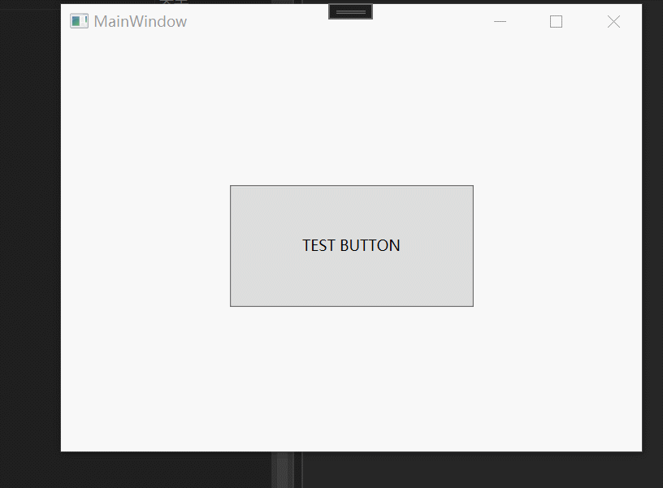
</div>

我们可以看到点击按钮时触发了命令，没有设置点击事件；

上述我们直接实现`ICommand`接口的命令，它只会在命令目标`Button`上起作用；


我们来为上述下载功能增加事件，实现效果如下：

<div align='center'>

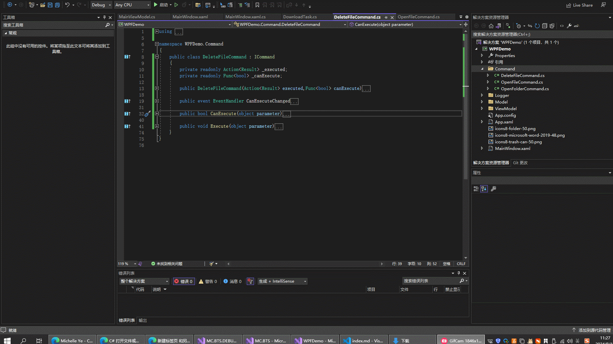
</div>

我们增加三个指令：打开文件夹指令&打开文件指令&删除文件指令
```csharp
using System;
using System.Diagnostics;
using System.IO;
using System.Windows;
using System.Windows.Input;
using WPFDemo.Logger;
using WPFDemo.Model;

namespace WPFDemo.Command
{
    public class OpenFolderCommand : ICommand
    {
        private readonly Func<bool> _canExecute;

        private readonly Action<Result> _executed;

        public OpenFolderCommand(Action<Result> executed, Func<bool> canExecute)
        {
            _executed = executed;
            _canExecute = canExecute;
        }

        event EventHandler ICommand.CanExecuteChanged
        {
            add
            {
                CommandManager.RequerySuggested += value;
            }

            remove
            {
                CommandManager.RequerySuggested -= value;
            }
        }

        bool ICommand.CanExecute(object parameter)
        {
            if(_canExecute != null)
            {
                return _canExecute();
            }
            return false;
        }

        void ICommand.Execute(object parameter)
        {
            try
            {
                if (parameter != null && parameter is string path)
                {
                    if (File.Exists(path))
                    {
                        Process.Start("explorer.exe", Path.GetDirectoryName(path));

                        _executed?.Invoke(new Result()
                        {
                            Success = true,
                        });
                    }
                    else
                    {
                        _executed?.Invoke(new Result()
                        {
                            Success = false,
                            Message = "文件不存在",
                        });
                    }
                }
            }
            catch (Exception e)
            {
                _executed?.Invoke(new Result()
                {
                    Success = false,
                    Message = e.Message,
                });
            }
        }
    }
}
```
```csharp
using System;
using System.Diagnostics;
using System.IO;
using System.Windows.Input;
using WPFDemo.Model;

namespace WPFDemo.Command
{
    public class OpenFileCommand : ICommand
    {
        private readonly Action<Result> _executed;
        private readonly Func<bool> _canExecute;

        public OpenFileCommand(Action<Result> executed, Func<bool> canExecute)
        {
            _executed = executed;
            _canExecute = canExecute;
        }

        public event EventHandler CanExecuteChanged
        {
            add
            {
                CommandManager.RequerySuggested += value;
            }

            remove
            {
                CommandManager.RequerySuggested -= value;
            }
        }

        public bool CanExecute(object parameter)
        {
            if (_canExecute != null)
            {
                return _canExecute();
            }
            return false;
        }

        public void Execute(object parameter)
        {
            try
            {
                if(parameter!=null&&parameter is string path)
                {
                    if (File.Exists(path))
                    {
                        Process.Start(path);
                        _executed?.Invoke(new Result()
                        {
                            Success = true,
                        });
                    }
                    else
                    {
                        _executed?.Invoke(new Result()
                        {
                            Success = false,
                            Message = "找不到文件"
                        });
                    }
                }
            }
            catch(Exception e)
            {
                _executed?.Invoke(new Result()
                {
                    Success = false,
                    Message = e.Message,
                });
            }
        }
    }
}
```
```csharp
using System;
using System.IO;
using System.Windows.Input;
using WPFDemo.Model;

namespace WPFDemo.Command
{
    public class DeleteFileCommand : ICommand
    {
        private readonly Action<Result> _executed;
        private readonly Func<bool> _canExecute;

        public DeleteFileCommand(Action<Result> executed,Func<bool> canExecute)
        {
            _executed = executed;
            _canExecute = canExecute;
        }

        public event EventHandler CanExecuteChanged
        {
            add
            {
                CommandManager.RequerySuggested += value;
            }

            remove
            {
                CommandManager.RequerySuggested -= value;
            }
        }

        public bool CanExecute(object parameter)
        {
            if (_canExecute != null)
            {
                return _canExecute();
            }
            return false;
        }

        public void Execute(object parameter)
        {
            try
            {
                if (parameter != null && parameter is string path)
                {
                    if (File.Exists(path))
                    {
                        File.Delete(path);
                        _executed?.Invoke(new Result()
                        {
                            Success = true,
                        });
                    }
                    else
                    {
                        _executed?.Invoke(new Result()
                        {
                            Success = false,
                            Message = "文件不存在",
                        });
                    }
                }
            }
            catch (Exception e)
            {
                _executed?.Invoke(new Result()
                {
                    Success = false,
                    Message = e.Message,
                });
            }
        }
    }
}
```

在`DownloadTask`增加命令：
```csharp
using System;
using System.IO;
using System.Windows;
using System.Windows.Input;
using WPFDemo.Command;

namespace WPFDemo.Model
{
    public class DownloadTask : ObservableObject
    {
        public DownloadTask(Action<Result> openFileExecuted, Action<Result> openFolderExecuted,Action<Result<Guid>> deleteFileExecuted)
        {
            OpenFileCommand = new OpenFileCommand(openFileExecuted, () => !downloading && success);
            OpenFolderCommand = new OpenFolderCommand(openFolderExecuted,() => !downloading&&success);
            DeleteFileCommand = new DeleteFileCommand((result) =>
            {
                var convert_result = new Result<Guid>()
                {
                    Success = result.Success,
                    Message = result.Message,
                };

                if (result.Success)
                {
                    convert_result.Data = Id;
                }

                deleteFileExecuted?.Invoke(convert_result);

            },() => !downloading&&success);
        }

        ...

        /// <summary>
        /// 打开文件夹命令
        /// </summary>
        public OpenFolderCommand OpenFolderCommand { get; set; }

        /// <summary>
        /// 删除文件命令
        /// </summary>
        public DeleteFileCommand DeleteFileCommand { get; set; }

        /// <summary>
        /// 打开文件命令
        /// </summary>
        public OpenFileCommand OpenFileCommand { get; set; }
    }
}
```


修改一下前台，主要修改为：将`<Image>`更换为`<Button>`且绑定命令
```csharp
<Window x:Class="WPFDemo.MainWindow"
        xmlns="http://schemas.microsoft.com/winfx/2006/xaml/presentation"
        xmlns:x="http://schemas.microsoft.com/winfx/2006/xaml"
        xmlns:d="http://schemas.microsoft.com/expression/blend/2008"
        xmlns:mc="http://schemas.openxmlformats.org/markup-compatibility/2006"
        xmlns:local="clr-namespace:WPFDemo"
        mc:Ignorable="d"
        Title="MainWindow" Height="450" Width="400"
        WindowStartupLocation="CenterScreen">

    <Grid>
        <ListBox 
            Name="listbox"
            ItemsSource="{Binding DownloadTasks}">
            <ListBox.ItemContainerStyle>
                <Style TargetType="ListBoxItem">
                    <Setter Property="Template">
                        <Setter.Value>
                            <ControlTemplate TargetType="ListBoxItem">
                                <ContentPresenter/>
                            </ControlTemplate>
                        </Setter.Value>
                    </Setter>
                </Style>
            </ListBox.ItemContainerStyle>
            <ListBox.ItemTemplate>
                <DataTemplate>
                    <Grid x:Name="item_box" Cursor="Hand" Margin="10 0 10 0" Height="80">
                        <Grid.ColumnDefinitions>
                            <ColumnDefinition Width="28"/>
                            <ColumnDefinition/>
                            <ColumnDefinition Width="Auto"/>
                        </Grid.ColumnDefinitions>

                        <Image Source="/icons8-microsoft-word-2019-48.png" Width="28" Height="28" Grid.Row="0" Grid.Column="0"/>

                        <StackPanel Orientation="Vertical" Grid.Row="0" Grid.Column="1" Margin="10">
                            <TextBlock Text="{Binding Name}" FontSize="15" Margin="0 10 0 0"/>

                            <Button Visibility="{Binding SuccessVisibility}" Command="{Binding OpenFileCommand}" CommandParameter="{Binding FilePath}">
                                <Button.Template>
                                    <ControlTemplate>
                                        <TextBlock Text="打开文件" FontSize="10" Margin="0 5 0 0" Foreground="#006fc4">
                                            <TextBlock.TextDecorations>
                                                <TextDecorationCollection>
                                                    <TextDecoration PenOffset="3"/>
                                                </TextDecorationCollection>
                                            </TextBlock.TextDecorations>
                                        </TextBlock>
                                    </ControlTemplate>
                                </Button.Template>
                            </Button>
                            <StackPanel Orientation="Vertical" Visibility="{Binding RateVisibility}">
                                <ProgressBar Margin="0 10 0 0" Value="{Binding Rate}"/>
                                <TextBlock Margin="0 3 0 0" Text="{Binding Message, StringFormat=提示: {0}}" x:Name="tb_tip"/>
                            </StackPanel>
                        </StackPanel>

                        <StackPanel Orientation="Horizontal"  Grid.Row="0" Grid.Column="2" Visibility="Collapsed" x:Name="box_edit">
                            <Button x:Name="btn_folder" Width="28" Height="28" Command="{Binding OpenFolderCommand}" CommandParameter="{Binding FilePath}">
                                <Button.Template>
                                    <ControlTemplate>
                                        <Border>
                                            <Image Source="/icons8-folder-50.png"/>
                                        </Border>
                                    </ControlTemplate>
                                </Button.Template>
                            </Button>

                            <Button x:Name="btn_delete" Width="28" Height="28" Margin="10 0 10 0" Command="{Binding DeleteFileCommand}" CommandParameter="{Binding FilePath}">
                                <Button.Template>
                                    <ControlTemplate>
                                        <Border>
                                            <Image Source="/icons8-trash-can-50.png"/>
                                        </Border>
                                    </ControlTemplate>
                                </Button.Template>
                            </Button>
                        </StackPanel>
                    </Grid>

                    <DataTemplate.Triggers>
                        <MultiDataTrigger>
                            <MultiDataTrigger.Conditions>
                                <Condition Binding="{Binding Success}" Value="True"/>
                                <Condition Binding="{Binding RelativeSource={RelativeSource Mode=Self}, Path=IsMouseOver}" Value="True"/>
                            </MultiDataTrigger.Conditions>
                            <MultiDataTrigger.Setters>
                                <Setter TargetName="box_edit" Property="Visibility" Value="Visible"/>
                                <Setter TargetName="item_box" Property="Background" Value="#f2f2f2"/>
                            </MultiDataTrigger.Setters>
                        </MultiDataTrigger>

                        <MultiDataTrigger>
                            <MultiDataTrigger.Conditions>
                                <Condition Binding="{Binding Success}" Value="False"/>
                                <Condition Binding="{Binding Downloading}" Value="False"/>
                            </MultiDataTrigger.Conditions>
                            <MultiDataTrigger.Setters>
                                <Setter TargetName="tb_tip" Property="Foreground" Value="Red"/>
                            </MultiDataTrigger.Setters>
                        </MultiDataTrigger>
                    </DataTemplate.Triggers>
                </DataTemplate>
            </ListBox.ItemTemplate>
        </ListBox>
    </Grid>
</Window>
```


后台代码如下，主要修改地方为：创建`DownloadTask`时传入委托
```csharp
using System;
using System.Collections.ObjectModel;
using System.Threading.Tasks;
using System.Windows;
using WPFDemo.Command;
using WPFDemo.Model;
using WPFDemo.ViewModel;

namespace WPFDemo
{
    /// <summary>
    /// MainWindow.xaml 的交互逻辑
    /// </summary>
    public partial class MainWindow : Window
    {
        private readonly MainViewModel _model;

        public MainWindow()
        {
            InitializeComponent();

            _model = new MainViewModel()
            {
                DownloadTasks = new ObservableCollection<DownloadTask>()
            };

            this.DataContext = _model;

            Task.Factory.StartNew(async () =>
            {
                await Task.Delay(1000);

                var task = new DownloadTask(ShowErrorResultMessage,ShowErrorResultMessage, DeleteFileExecuted)
                {
                    Id = Guid.NewGuid(),
                    FilePath = "D://Downloads//test_file1.docx",
                    SuccessVisibility = Visibility.Collapsed,
                    RateVisibility = Visibility.Visible,
                    Downloading = true,
                };

                listbox.Dispatcher.Invoke(() => _model.DownloadTasks.Add(task));

                while (task.Rate != 100)
                {
                    listbox.Dispatcher.Invoke(() =>
                    {
                        task.Rate += 1;
                        task.Message = $"{task.Rate}%";
                    });

                    await Task.Delay(50);
                }
                listbox.Dispatcher.Invoke(() =>
                {
                    task.Success = true;
                    task.Downloading = false;
                });
            });

            Task.Factory.StartNew(async () =>
            {
                DownloadTask task = null;
                try
                {
                    await Task.Delay(1500);

                    task = new DownloadTask(ShowErrorResultMessage,ShowErrorResultMessage, DeleteFileExecuted)
                    {
                        Id = Guid.NewGuid(),
                        FilePath = "D://Downloads//test_file2.docx",
                        SuccessVisibility = Visibility.Collapsed,
                        RateVisibility = Visibility.Visible,
                        Downloading = true,
                    };

                    listbox.Dispatcher.Invoke(() => _model.DownloadTasks.Add(task));

                    while (task.Rate != 100)
                    {
                        listbox.Dispatcher.Invoke(() =>
                        {
                            task.Rate += 1;
                            task.Message = $"{task.Rate}%";
                        });

                        if (task.Rate == 50)
                        {
                            throw new Exception("模拟错误");
                        }

                        await Task.Delay(50);
                    }
                    listbox.Dispatcher.Invoke(() =>
                    {
                        task.Success = true;
                        task.Downloading = false;
                    });
                }
                catch (Exception e)
                {

                    if (task != null)
                    {
                        listbox.Dispatcher.Invoke(() =>
                        {
                            task.Success = false;
                            task.Message = e.Message;
                            task.Downloading = false;
                        });
                    }
                }
            });
        }

        private void ShowErrorResultMessage(Result result)
        {
            if(result != null)
            {
                if(!result.Success)
                {
                    MessageBox.Show(result.Message);
                }
            }
        }

        private void DeleteFileExecuted(Result<Guid> result)
        {
            if (result != null)
            {
                if (!result.Success)
                {
                    MessageBox.Show(result.Message);
                }
                else
                {
                    ShowErrorResultMessage(_model.RemoveTask(result.Data));
                }
            }
        }
    }
}
```

在WPF中有一种命令叫路由命令，当命令没有被命令目标所执行时，会在元素数上向上传递；

```csharp
<Window x:Class="WPFDemo.MainWindow"
        xmlns="http://schemas.microsoft.com/winfx/2006/xaml/presentation"
        xmlns:x="http://schemas.microsoft.com/winfx/2006/xaml"
        xmlns:d="http://schemas.microsoft.com/expression/blend/2008"
        xmlns:mc="http://schemas.openxmlformats.org/markup-compatibility/2006"
        xmlns:local="clr-namespace:WPFDemo"
        mc:Ignorable="d"
        Title="MainWindow" Height="450" 
        Width="800">

    <Window.Resources>
        <RoutedCommand x:Key="cmd_routed"/>
    </Window.Resources>

    <Grid>
        <Button Content="TEST BUTTON" Width="200" Height="100" Command="{StaticResource cmd_routed}">
            <Button.CommandBindings>
                <CommandBinding Command="{StaticResource cmd_routed}"
                                CanExecute="CommandBinding_CanExecute"
                                Executed="CommandBinding_Executed"/>
            </Button.CommandBindings>
        </Button>
    </Grid>
</Window>
```

```csharp
using System.Windows;
using System.Windows.Input;
using WPFDemo.Logger;

namespace WPFDemo
{
    /// <summary>
    /// MainWindow.xaml 的交互逻辑
    /// </summary>
    public partial class MainWindow : Window
    {
        public MainWindow()
        {
            InitializeComponent();
        }

        private void CommandBinding_CanExecute(object sender, CanExecuteRoutedEventArgs e)
        {
            e.CanExecute = true;
        }

        private void CommandBinding_Executed(object sender, ExecutedRoutedEventArgs e)
        {
            Log.i("Button.Executed");
        }
    }
}
```

<div align='center'>

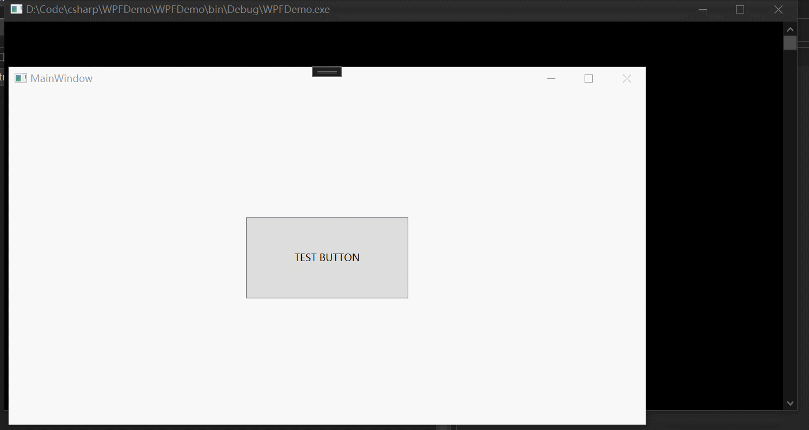
</div>

我们创建了一个路由命令，名字叫`cmd_routed`，然后在`Button.CommandBinding`绑定路由命令且注册事件；

在上述代码上是由`Button`来处理这个命令，我们来修改一下代码：
```csharp
<Window x:Class="WPFDemo.MainWindow"
        xmlns="http://schemas.microsoft.com/winfx/2006/xaml/presentation"
        xmlns:x="http://schemas.microsoft.com/winfx/2006/xaml"
        xmlns:d="http://schemas.microsoft.com/expression/blend/2008"
        xmlns:mc="http://schemas.openxmlformats.org/markup-compatibility/2006"
        xmlns:local="clr-namespace:WPFDemo"
        mc:Ignorable="d"
        Title="MainWindow" Height="450" 
        Width="800">

    <Window.Resources>
        <RoutedCommand x:Key="cmd_routed"/>
    </Window.Resources>

    <Grid>
        <Grid.CommandBindings>
            <CommandBinding Command="{StaticResource cmd_routed}"
                            CanExecute="CommandBinding_CanExecute"
                            Executed="CommandBinding_Executed"/>
        </Grid.CommandBindings>
        
        <Button Content="TEST BUTTON" Width="200" Height="100" Command="{StaticResource cmd_routed}">
        </Button>
    </Grid>
</Window>
```

```csharp
using System.Windows;
using System.Windows.Input;
using WPFDemo.Logger;

namespace WPFDemo
{
    /// <summary>
    /// MainWindow.xaml 的交互逻辑
    /// </summary>
    public partial class MainWindow : Window
    {
        public MainWindow()
        {
            InitializeComponent();
        }

        private void CommandBinding_CanExecute(object sender, CanExecuteRoutedEventArgs e)
        {
            e.CanExecute = true;
        }

        private void CommandBinding_Executed(object sender, ExecutedRoutedEventArgs e)
        {
            Log.i("Grid.Executed");
        }
    }
}
```

<div align='center'>

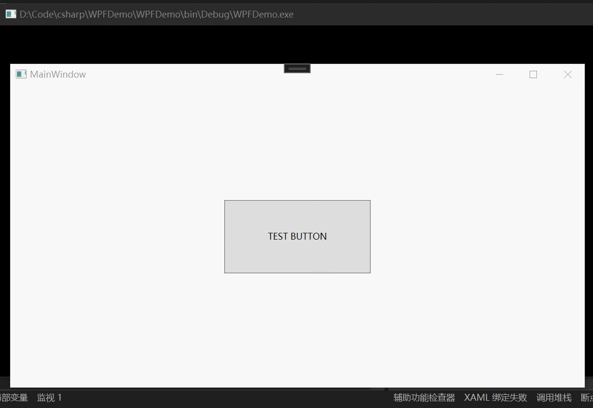
</div>

我们可以看到由`Button`触发的命令，但是是由`Grid`来处理的；

路由命令有冒泡的行为，当 RoutedCommand 被触发时，WPF 会检查当前焦点元素的 CommandBindings。如果当前元素的 CanExecute 方法返回 false，WPF 会向上遍历元素树，直到找到一个 CanExecute 返回 true 的元素；如果所有CanExecute都返回的是false，那就是表示该命令不可执行；

路由命令还能与输入手势（Input Gestures）关联，输入手势通常会是键盘组合键或者鼠标动作；


```csharp
<Window x:Class="WPFDemo.MainWindow"
        xmlns="http://schemas.microsoft.com/winfx/2006/xaml/presentation"
        xmlns:x="http://schemas.microsoft.com/winfx/2006/xaml"
        xmlns:d="http://schemas.microsoft.com/expression/blend/2008"
        xmlns:mc="http://schemas.openxmlformats.org/markup-compatibility/2006"
        xmlns:local="clr-namespace:WPFDemo"
        mc:Ignorable="d"
        Title="MainWindow" Height="450" 
        Width="800">

    <Window.Resources>
        <RoutedCommand x:Key="cmd_routed"/>
    </Window.Resources>

    <Window.CommandBindings>
        <CommandBinding Command="{StaticResource cmd_routed}"
                        CanExecute="CommandBinding_CanExecute"
                        Executed="CommandBinding_Executed"/>
    </Window.CommandBindings>

    <Window.InputBindings>
        <KeyBinding Gesture="Control+S" Command="{StaticResource cmd_routed}"/>
    </Window.InputBindings>

    <Grid>
        <Button Content="TEST BUTTON" Width="200" Height="100" Command="{StaticResource cmd_routed}"/>
    </Grid>
</Window>
```

输入手势可以在`Application`上注册为全局手势，但我们需要为窗口/控件注册输入手势时，那么只有在其获得焦点时才会触发手势；


## 依赖属性

依赖属性`DependencyProperty`，我们把鼠标放在定义上可以看到说明：
<div align='center'>


</div>

WPF的核心功能就是数据绑定，那么我们通过数据绑定来了解依赖属性；


我们以`TextBox.Text`举例，F12进入`TextBox`，可以看到以下代码：
```csharp
public class TextBox : TextBoxBase, IAddChild, ITextBoxViewHost{
    public static readonly DependencyProperty TextProperty;

    [DefaultValue("")]
    [Localizability(LocalizationCategory.Text)]
    public string Text
    {
        get
        {
            return (string)GetValue(TextProperty);
        }
        set
        {
            SetValue(TextProperty, value);
        }
    }

    static TextBox(){
        TextProperty = DependencyProperty.Register("Text", typeof(string), typeof(TextBox), new FrameworkPropertyMetadata(string.Empty, FrameworkPropertyMetadataOptions.BindsTwoWayByDefault | FrameworkPropertyMetadataOptions.Journal, OnTextPropertyChanged, CoerceText, isAnimationProhibited: true, UpdateSourceTrigger.LostFocus));
    }
}
```


一：通过`DependencyProperty.Register`注册依赖属性

我们通过不断的F12可以看出注册的依赖属性信息是放在`DependencyProperty.PropertyFromName`里面，在存放时会绑定对应的`GlobalIndex`，也就是说一个依赖属性对应一个`GlobalIndex`；

二：通过`SetValue&GetValue`来设置获取值

这个方法是在`DependencyObject`中实现的，我们的窗口也有继承于它，所以在我们的窗口中也可以实现`GetValue()/SetValue()`。

继续F12查看可以看出，依赖属性的值是存放在`DependencyObject._effectiveValues`里面；


下面我们来实战一下：

主窗口的设计代码：
```csharp
<Window x:Class="WPFDemo.MainWindow"
        xmlns="http://schemas.microsoft.com/winfx/2006/xaml/presentation"
        xmlns:x="http://schemas.microsoft.com/winfx/2006/xaml"
        xmlns:d="http://schemas.microsoft.com/expression/blend/2008"
        xmlns:mc="http://schemas.openxmlformats.org/markup-compatibility/2006"
        xmlns:local="clr-namespace:WPFDemo"
        mc:Ignorable="d"
        Title="MainWindow" 
        Height="450" 
        Width="800">

    <Grid>
        <TextBox Width="200" Height="50" Text="{Binding Content}" x:Name="textBox"/>

        <Button Content="GET" Width="100" Height="30" Margin="0 130 0 0" Click="Button_Click"/>
    </Grid>
</Window>
```

对应设计图如下：
<div align='center'>

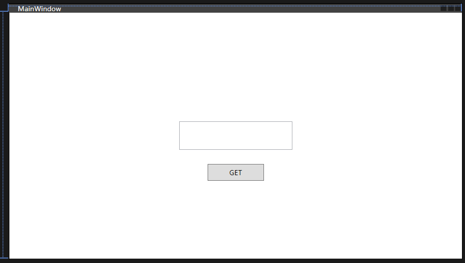
</div>

点击按钮时获取`TextBox.Text`的信息：
```csharp
using System;
using System.Collections;
using System.Windows;
using WPFDemo.ViewModel;

namespace WPFDemo
{
    /// <summary>
    /// MainWindow.xaml 的交互逻辑
    /// </summary>
    public partial class MainWindow : Window
    {
        public MainWindow()
        {
            InitializeComponent();

            this.DataContext = new MainViewModel()
            {
                Content = "Hello,World"
            };
        }
        private void Button_Click(object sender, RoutedEventArgs e)
        {

            var dpTextBoxContentGlobalIndex = 0;

            {
                var type = typeof(DependencyProperty);

                var field = type.GetField("PropertyFromName", System.Reflection.BindingFlags.NonPublic | System.Reflection.BindingFlags.Static | System.Reflection.BindingFlags.GetProperty);

                if (field.GetValue(type) is Hashtable hashtable)
                {
                    foreach (System.Collections.DictionaryEntry it in hashtable)
                    {
                        var value_type = it.Value.GetType();

                        var value_fields = value_type.GetFields(System.Reflection.BindingFlags.NonPublic | System.Reflection.BindingFlags.Instance);

                        var v0 = value_fields[0].GetValue(it.Value);

                        var v2 = value_fields[2].GetValue(it.Value);

                        var property = v0.ToString();

                        var claxx = v2.ToString();

                        if (claxx == "System.Windows.Controls.TextBox" && property == "Text")
                        {
                            var get_GlobalIndex = value_type.GetMethod("get_GlobalIndex", System.Reflection.BindingFlags.Public | System.Reflection.BindingFlags.Instance);

                            var value = get_GlobalIndex.Invoke(it.Value, null);

                            dpTextBoxContentGlobalIndex = Convert.ToInt32(value);
                        }
                    }
                }
            }

            {

                var type = textBox.GetType();

                while(type != typeof(DependencyObject))
                {
                    type = type.BaseType;
                }

                var field = type.GetField("_effectiveValues", System.Reflection.BindingFlags.NonPublic | System.Reflection.BindingFlags.Instance);

                var value = field.GetValue(textBox);

                // System.Windows.EffectiveValueEntry

                var value_type = value.GetType();

                // value_type.BaseType = typeof(Array)

                var length = (int) value_type.BaseType.GetProperty("Length").GetValue(value);

                var method = value_type.BaseType.GetMethod("GetValue", new Type[] { typeof(int) });

                for (var i = 0; i < length; i++)
                {
                    var item_value = method.Invoke(value, new object[] { i });

                    var pindex = (int) item_value.GetType().GetProperty("PropertyIndex").GetValue(item_value);

                    if(pindex == dpTextBoxContentGlobalIndex)
                    {
                        // System.Windows.Data.BindingExpression

                        // 依赖属性值区域
                    }
                }

            }
        }
    }
}
```

我们可以看到以下信息：

<div align='center'>

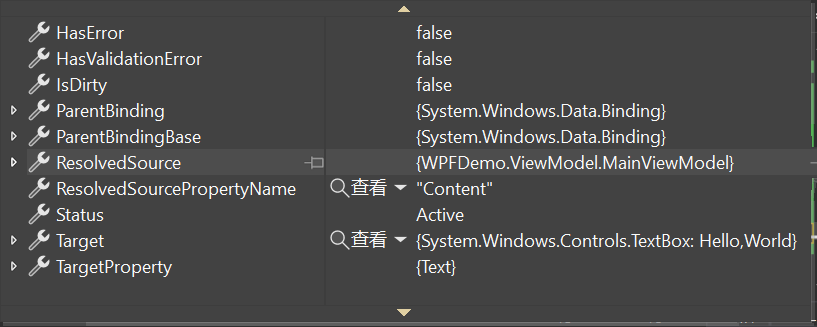
</div>

里面包含了对应的绑定对象以及字段信息；

到这里数据绑定的秘密基本揭开了，我认为的数据绑定可以由下面这种思路实现，不一定是源码实现方式：

我们看看`ViewModel`信息：
```csharp
using System.ComponentModel;
using System.Runtime.CompilerServices;

namespace WPFDemo.Model
{
    public class ObservableObject : INotifyPropertyChanged
    {
        public event PropertyChangedEventHandler PropertyChanged;

        public void RaisePropertyChanged([CallerMemberName] string propertyName = "")
        {
            PropertyChanged?.Invoke(this, new PropertyChangedEventArgs(propertyName));
        }
    }
}

using WPFDemo.Model;

namespace WPFDemo.ViewModel
{
    internal class MainViewModel:ObservableObject
    {
        private string _content {  get; set; }

        public string Content
        {
            get { return _content; }
            set { _content = value;RaisePropertyChanged(nameof(Content)); }
        }
    }
}
```

当我们修改属性时会通知页面我的属性发生了改变，这时候就遍历所有的依赖对象，依赖对象里面遍历`_effectiveValues`，如果对象和属性都对应上了，重新获取对象属性值，并更新页面值；


#  自定义控件

我们使用WPF实现以下效果：

<div align='center'>


</div>


首先我们来看第一个页面，添加设备`AddDeviceWindow.xaml`：

设计图如下所示：
<div align='center'>

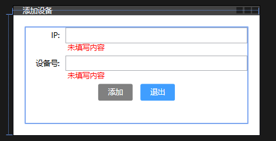
</div>

这里需求点如下：

一： `Button`样式修改：增加圆角，设置背景颜色，经过时修改背景颜色，禁用状态设置背景颜色

右键添加资源字典，文件名称为：`ButtonStyle`，内容如下：
```csharp
<ResourceDictionary xmlns="http://schemas.microsoft.com/winfx/2006/xaml/presentation"
                    xmlns:x="http://schemas.microsoft.com/winfx/2006/xaml">
    <Style x:Key="PrimaryButton" TargetType="Button">
        <Style.Setters>
            <Setter Property="Template">
                <Setter.Value>
                    <ControlTemplate TargetType="Button">
                        <Border Cursor="Hand" x:Name="border" Background="#409eff" CornerRadius="3" BorderThickness="1" Padding="{TemplateBinding Padding}">
                            <TextBlock Text="{TemplateBinding Content}" Foreground="White" Padding="15 5 15 5"/>
                        </Border>

                        <ControlTemplate.Triggers>
                            <Trigger Property="IsMouseOver" Value="True">
                                <Setter TargetName="border" Property="Background" Value="#66b1ff"/>
                            </Trigger>

                            <Trigger Property="IsEnabled" Value="False">
                                <Setter TargetName="border" Property="Background" Value="gray"/>
                            </Trigger>
                        </ControlTemplate.Triggers>
                    </ControlTemplate>
                </Setter.Value>
            </Setter>
        </Style.Setters>
    </Style>
</ResourceDictionary>
```

然后在`App.xaml`中添加该资源字典：
```csharp
<Application x:Class="CustomBatteryPanel.App"
             xmlns="http://schemas.microsoft.com/winfx/2006/xaml/presentation"
             xmlns:x="http://schemas.microsoft.com/winfx/2006/xaml"
             xmlns:local="clr-namespace:CustomBatteryPanel"
             StartupUri="MainWindow.xaml">
    <Application.Resources>
        <ResourceDictionary>
            <ResourceDictionary.MergedDictionaries>
                <ResourceDictionary Source="./Style/ButtonStyle.xaml"/>
            </ResourceDictionary.MergedDictionaries>
        </ResourceDictionary>
    </Application.Resources>
</Application>
```

二： 为`TextBox`增加内容校验

我们需要增加IP校验规则以及设备号校验规则：
```csharp
using System.Globalization;
using System.Text.RegularExpressions;
using System.Windows.Controls;

namespace CustomBatteryPanel.Rule
{
    public class IPValidationRule : ValidationRule
    {
        public override ValidationResult Validate(object value, CultureInfo cultureInfo)
        {
            var pattern = "(([01]?[0-9]?[0-9])|(2[0-4][0-9])|(25[0-5]))\\.(([01]?[0-9]?[0-9])|(2[0-4][0-9])|(" +
            "25[0-5]))\\.(([01]?[0-9]?[0-9])|(2[0-4][0-9])|(25[0-5]))\\.(([01]?[0-9]?[0-9])|(2[" +
            "0-4][0-9])|(25[0-5]))";

            if(string.IsNullOrEmpty(value?.ToString()))
            {
                return new ValidationResult(false, "未填写内容");
            }

            if(value != null && Regex.Match(value.ToString(),pattern).Success)
            {
                return ValidationResult.ValidResult;
            }
            return new ValidationResult(false, "不符合IP规则");
        }
    }
}

```

```csharp
using System.Globalization;
using System.Windows.Controls;

namespace CustomBatteryPanel.Rule
{
    public class PositiveIntegerValidationRule : ValidationRule
    {
        public override ValidationResult Validate(object value, CultureInfo cultureInfo)
        {
            if (value == null || string.IsNullOrEmpty(value.ToString()))
            {
                return new ValidationResult(false, "未填写内容");
            }

            if(int.TryParse(value.ToString(),out var number))
            {
                if(number < 0)
                {
                    return new ValidationResult(false, "不能小于0");
                }
                return ValidationResult.ValidResult;
            }
            else
            {
                return new ValidationResult(false, "非法数字");
            }
        }
    }
}
```

创建`AddDeviceViewModel`：
```csharp
using CustomBatteryPanel.Model;
using CustomBatteryPanel.Rule;

namespace CustomBatteryPanel.ViewModel
{
    public class AddDeviceViewModel:ObservableObject,IValidationExceptionHandler
    {
        public Device Device { get; set; }
        private bool isValid { get; set; }
        public bool IsValid
        {
            get
            {
                return isValid;
            }
            set
            {
                isValid = value;
                RaisePropertyChanged();
            }
        }
    }
}
```

为`TextBox`绑定属性以及校验规则：
```csharp
<DockPanel>
    <Label Content="IP:" Width="60" HorizontalContentAlignment="Right"/>
    <TextBox Margin="5 0 0 0" TextAlignment="Left" VerticalContentAlignment="Center">
        <TextBox.Text>
            <Binding Path="Device.IP" UpdateSourceTrigger="LostFocus" NotifyOnValidationError="True">
                <Binding.ValidationRules>
                    <rule:IPValidationRule ValidatesOnTargetUpdated="True"/>
                </Binding.ValidationRules>
            </Binding>
        </TextBox.Text>
        <Validation.ErrorTemplate>
            <ControlTemplate>
                <DockPanel>
                    <Grid DockPanel.Dock="Bottom" Width="auto" Height="auto" VerticalAlignment="Center" Margin="3 0 0 0">
                        <TextBlock Width="auto" Height="auto" Foreground="Red"
                            Text="{Binding ElementName=holderIP, Path=AdornedElement.(Validation.Errors)[0].ErrorContent}"/>
                    </Grid>
                    <Border BorderBrush="Red" BorderThickness="0" CornerRadius="2">
                        <AdornedElementPlaceholder x:Name="holderIP"/>
                    </Border>
                </DockPanel>
            </ControlTemplate>
        </Validation.ErrorTemplate>
    </TextBox>
</DockPanel>
<DockPanel Margin="0 20 0 20">
    <Label Content="设备号:" Width="60" HorizontalContentAlignment="Right"/>
    <TextBox Margin="5 0 0 0" TextAlignment="Left" VerticalContentAlignment="Center">
        <TextBox.Text>
            <Binding Path="Device.Id" UpdateSourceTrigger="PropertyChanged" NotifyOnValidationError="True">
                <Binding.ValidationRules>
                    <rule:PositiveIntegerValidationRule ValidatesOnTargetUpdated="True"/>
                </Binding.ValidationRules>
            </Binding>
        </TextBox.Text>
        <Validation.ErrorTemplate>
            <ControlTemplate>
                <DockPanel>
                    <Grid DockPanel.Dock="Bottom" Width="auto" Height="auto" VerticalAlignment="Center" Margin="3 0 0 0">
                        <TextBlock Width="auto" Height="auto" Foreground="Red"
                        Text="{Binding ElementName=holderDevId, Path=AdornedElement.(Validation.Errors)[0].ErrorContent}"/>
                    </Grid>
                    <Border BorderBrush="Red" BorderThickness="0" CornerRadius="2">
                        <AdornedElementPlaceholder x:Name="holderDevId"/>
                    </Border>
                </DockPanel>
            </ControlTemplate>
        </Validation.ErrorTemplate>
    </TextBox>
</DockPanel>
```

三： 添加按钮设置'添加设备命令'，如果IP&设备号校验不通过时，命令不允许执行；

我们需要一个状态，知道页面上是否存在校验失败的情况，这时候我们可以使用`Behavior`，它可以帮助我们为控件附加事件，这里我们需要附加`Validation.ErrorEvent`，不难看出就是在校验失败错误事件；

想要实现behavior，我们需要单独安装套件：`Microsoft.Xaml.Behaviors.Wpf`

然后实现自定义行为：
```csharp
namespace CustomBatteryPanel.Rule
{
    public interface IValidationExceptionHandler
    {
        /// <summary>
        /// 是否有效
        /// </summary>
        bool IsValid
        {
            get;
            set;
        }
    }
}
```

```csharp
using CustomBatteryPanel.Rule;
using Microsoft.Xaml.Behaviors;
using System;
using System.Windows;
using System.Windows.Controls;

namespace CustomBatteryPanel.Behaviors
{
    public class ValidationExceptionBehavior : Behavior<FrameworkElement>
    {
        /// <summary>
        /// 错误计数器
        /// </summary>
        private int _validationExceptionCount = 0;

        /// <summary>
        /// 附加对象时
        /// </summary>
        protected override void OnAttached()
        {
            this.AssociatedObject.AddHandler(Validation.ErrorEvent, new EventHandler<ValidationErrorEventArgs>(this.OnValidationError));
        }

        private void OnValidationError(object sender, ValidationErrorEventArgs arg)
        {
            try
            {
                if (this.AssociatedObject.DataContext is IValidationExceptionHandler)
                {
                    var handler = this.AssociatedObject.DataContext as IValidationExceptionHandler;

                    var element = arg.OriginalSource as UIElement;

                    if (handler == null || element == null)
                        return;

                    if (arg.Action == ValidationErrorEventAction.Added)
                    {
                        _validationExceptionCount++;

                    }
                    else if (arg.Action == ValidationErrorEventAction.Removed)
                    {
                        _validationExceptionCount--;
                    }

                    handler.IsValid = _validationExceptionCount == 0;
                }
                else
                {

                }
            }
            catch (Exception e)
            {
                // TODO
            }
        }
    }
}
```

然后我们来看主页面的设计图：

<div align='center'>

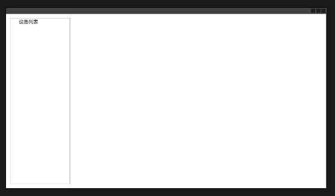
</div>

左侧是设备列表，右侧是面板区域，我们主要实现以下需求：

一：`TreeView`绑定设备列表

`MainViewModel`文件如下：
```csharp
using CustomBatteryPanel.Data;
using CustomBatteryPanel.Model;
using System.Collections.ObjectModel;

namespace CustomBatteryPanel.ViewModel
{
    public class MainViewModel:ObservableObject
    {
        public ObservableCollection<Device> Devices => DeviceBuffer.Instance.Devices;
    }
}
```

然后我们在`TreeView`上绑定：
```csharp
<TreeView x:Name="treeView" DockPanel.Dock="Left" Width="150" Margin="10 10 5 10" SelectedItemChanged="TreeView_SelectedItemChanged">
    <TreeView.ContextMenu>
        <ContextMenu>
            <MenuItem Name="AddDevice" Header="添加设备" Click="AddDevice_Click"/>
            <MenuItem Name="DeleteDevice" Header="删除设备" Click="DeleteDevice_Click"/>
        </ContextMenu>
    </TreeView.ContextMenu>
    <TreeViewItem Header="设备列表" ItemsSource="{Binding Devices}" IsExpanded="True">
        <TreeViewItem.ItemTemplate>
            <DataTemplate>
                <TextBlock>
                    <TextBlock.Text>
                        <MultiBinding StringFormat="{}{0}[{1}]">
                            <Binding Path="IP"/>
                            <Binding Path="Id"/>
                        </MultiBinding>
                    </TextBlock.Text>
                </TextBlock>
            </DataTemplate>
        </TreeViewItem.ItemTemplate>
    </TreeViewItem>
</TreeView>
```

二：绘制电池面板

右键添加用户控件：`BatteryPanel`，继承至`ScrollViewer`：能让布局能够滚动起来；

这里只粘贴其中的构造方法以及绘制方法：

```csharp
public partial class BatteryPanel : ScrollViewer
{
    /// <summary>
    /// 画布
    /// </summary>
    private readonly Canvas _ctx = new Canvas();

    public BatteryPanel()
    {
        _ctx.HorizontalAlignment = HorizontalAlignment.Left;
        _ctx.VerticalAlignment = VerticalAlignment.Top;
        Content = _ctx;
        HorizontalScrollBarVisibility = ScrollBarVisibility.Auto;
        VerticalScrollBarVisibility= ScrollBarVisibility.Auto;
    }

    private void OnPaint(bool redraw)
    {
        if (!redraw && !_elements.Any())
            return;

        _lastPaintTime = Environment.TickCount;

        //Log.i("OnPaint");

        if (redraw)
        {
            _ctx.Children.Clear();
            var builder = new StringBuilder();
            foreach (var element in _elements)
            {
                element.Container = new Path()
                {
                    Fill = Brushes.Gray,
                };

                var centerX = element.Rectangle.X + element.Rectangle.Width / 2;

                var endX = element.Rectangle.X + element.Rectangle.Width;

                var endY = element.Rectangle.Y + element.Rectangle.Height;

                var startX = element.Rectangle.X;

                var startY = element.Rectangle.Y;

                var width41 = element.Rectangle.Width / 4;

                // 1
                builder.Append($"M {centerX - width41},{element.Rectangle.Y + _radius} ");
                builder.Append($"A {_radius},{_radius} 0 0 1 {centerX - width41 + _radius},{element.Rectangle.Y} ");

                // 2
                builder.Append($"L {centerX + width41 - _radius},{element.Rectangle.Y} ");
                builder.Append($"A {_radius},{_radius} 0 0 1 {centerX + width41},{element.Rectangle.Y + _radius} ");

                // 3
                builder.Append($"L {centerX + width41},{element.Rectangle.Y + _electrodeHeight - _radius} ");
                builder.Append($"A {_radius},{_radius} 0 0 0 {centerX + width41 + _radius},{element.Rectangle.Y + _electrodeHeight} ");

                // 4
                builder.Append($"L {endX - _radius},{element.Rectangle.Y + _electrodeHeight} ");
                builder.Append($"A {_radius},{_radius} 0 0 1 {endX},{element.Rectangle.Y + _electrodeHeight + _radius} ");

                // 5
                builder.Append($"L {endX},{endY - _radius} ");
                builder.Append($"A {_radius},{_radius} 0 0 1 {endX - _radius},{endY} ");

                // 6
                builder.Append($"L {startX + _radius},{endY} ");
                builder.Append($"A {_radius},{_radius} 0 0 1 {startX},{endY - _radius}");

                // 7
                builder.Append($"L {startX},{startY + _electrodeHeight + _radius} ");
                builder.Append($"A {_radius},{_radius} 0 0 1 {startX + _radius},{startY + _electrodeHeight} ");

                // 8
                builder.Append($"L {startX + width41 - _radius},{startY + _electrodeHeight} ");
                builder.Append($"A {_radius},{_radius} 0 0 0 {startX + width41},{startY + _electrodeHeight - _radius} ");

                builder.Append($"L {centerX - width41},{element.Rectangle.Y + _radius} Z");

                element.Container.Data = Geometry.Parse(builder.ToString());

                if (element.IsSeleted)
                {
                    element.Container.Stroke = Brushes.Black;
                    element.Container.StrokeThickness = 1;
                }
                else
                {
                    element.Container.StrokeThickness = 0;
                    element.Container.Stroke = Brushes.Transparent;
                }

                _ctx.Children.Add(element.Container);

                // Label1 -> 设备ID-通道ID
                element.labelKey = new Label()
                {
                    VerticalContentAlignment = VerticalAlignment.Center,
                    HorizontalContentAlignment = HorizontalAlignment.Center,
                    Width = element.Rectangle.Width,
                    Height = _electrodeHeight,
                    Content = $"{element.DevId}-{element.ChannelId}",
                };
                Canvas.SetTop(element.labelKey, element.Rectangle.Y);
                Canvas.SetLeft(element.labelKey, element.Rectangle.X);
                _ctx.Children.Add(element.labelKey);


                // Label1 -> 工步名称
                element.labelStepName = new Label()
                {
                    VerticalContentAlignment = VerticalAlignment.Center,
                    HorizontalContentAlignment = HorizontalAlignment.Center,
                    Width = element.Rectangle.Width,
                    Height = element.LineHeight + 3,
                    Content = element.StepName,
                    Padding = new Thickness(0),
                };
                Canvas.SetTop(element.labelStepName, element.Rectangle.Y + _electrodeHeight);
                Canvas.SetLeft(element.labelStepName, element.Rectangle.X);
                _ctx.Children.Add(element.labelStepName);

                // TextBlock1 -> 实时数据
                element.blockContent = new TextBlock()
                {
                    Text = string.Join("\n", element.Content),
                    Padding = new Thickness(3, 0, 0, 0),
                    LineHeight = element.LineHeight + 6,
                };
                Canvas.SetTop(element.blockContent, element.Rectangle.Y + _electrodeHeight + element.LineHeight + 3);
                Canvas.SetLeft(element.blockContent, element.Rectangle.X);
                _ctx.Children.Add(element.blockContent);

                builder.Clear();
            }
        }
        else
        {
            foreach (var element in _elements)
            {
                element.labelStepName.Content = element.StepName;
                element.blockContent.Text = string.Join("\n", element.Content);

                if (element.IsSeleted)
                {
                    element.Container.Stroke = Brushes.Black;
                    element.Container.StrokeThickness = 1;
                }
                else
                {
                    element.Container.StrokeThickness = 0;
                    element.Container.Stroke = Brushes.Transparent;
                }
            }
        }
    }
}
```


可以看到这里自定义控件实际是通过`Canvas`来完成，通过路径`PathGeometry`完成通道图形的绘制，文字实现`TextBlock`控件展示；

当我们调试输出`builder`的内容是是看到一串由M/A/L以及数字构成的字符串，这其实代表的是微图形语言，能够简化生成路径的代码；

字母对应的意思如下：

<div align='center'>

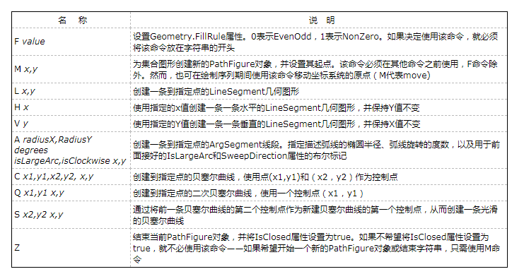
</div>

例如：

```csharp
<Path Stroke="Black" Fill="Transparent" Data="M 10,100 A 80,80 0 0 1 100,100"/>
```

这里的 M 命令移动到起点（10,100），A 命令绘制弧线，其中 80,80 是椭圆的半径，0 是 x 轴旋转角度（通常为 0），0 0 1 指定了弧线是顺时针方向（如果是 0 0 0 则为逆时针），100,100 是弧线的终点。

# 小结

WPF页面写法其实是与HTML类似，但不如HTML来的简单，但WPF来对比Winform可以发现一些控件实现的效果要更简单了，例如按钮的圆角，换做Winform要写一堆代码；

此外WPF对于页面与逻辑更好的解耦了，对比Winform会精简不少的代码，开发效率更好；

下面附上学习文章：

- 「[WPF中文网](https://www.wpfsoft.com/)」

- [使用 C# 编译器解释的属性确定调用方信息](https://learn.microsoft.com/zh-cn/dotnet/csharp/language-reference/attributes/caller-information)

- [Command 的一些使用方案 ](https://www.cnblogs.com/tcjiaan/p/18327235)

- [路径和几何图形](https://www.cnblogs.com/Peter-Luo/p/12318340.html)

- [如何控制右键菜单ContextMenu的弹出](https://blog.csdn.net/weixin_30883271/article/details/98348263)

点击下载示例代码：[文件下载Demo](./file/WPFDownloadDemo.7z) | [电池面板Demo](./file/CustomBatteryPanel.7z)
