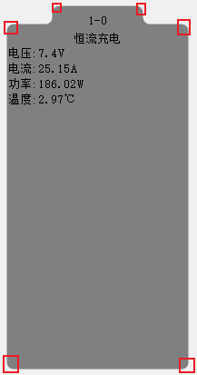
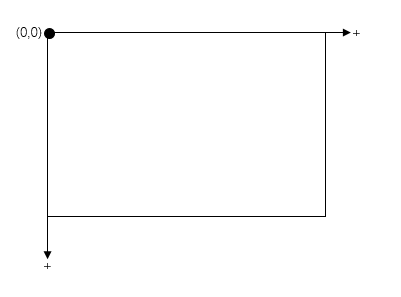
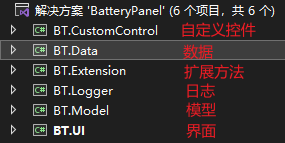
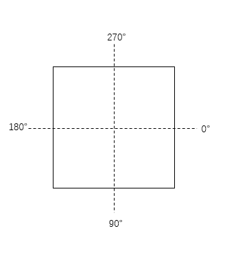

# 前言

在使用Winform编写PC程序时，但系统控件无法满足我们的需求的时候，我们就需要自定义控件。这一节的内容就是关于如何自定义控件，我们以公司实际项目中的电池面板为例进行学习，下面是最终的效果图：

<div align='center'>


</div>

电池面板里面一个个的元素被称为通道，它里面显示了当前测试通道的信息；

# 分析

<div align='center'>


</div>

从上面这张图片来看，这个元素其实可以分为上面小矩形和下面大矩形构成，但是Winform的GDI+在绘制矩形的时候没有设置圆角的参数的，所以不能使用绘制矩形的方式实现；

想要绘制圆角，我们需要使用绘制圆弧的方式，我们只需要 **按顺序** 绘制圆角，然后闭合路径，这个轮廓就出来了；

知道怎么绘制这个元素是第一步，我们还需要了解这个控件的坐标体系，它的坐标体系是这样的：

<div align='center'>


</div>

左上角为原点，向右向下为正向；当出现垂直滚动条时，我们如果把滚动条往下滑，位于顶部内容会被滑出显示区域，这时它的Y就是负数的，同理水平滚动条也是一样的；

# 实现

所谓的自定义控件呢，其实就是我们使用画笔去绘制自己想要的图形，当我们自定义控件的时候我们会继承于Panel，然后在`OnPaint()`中在画布上绘制；

先来看看我们的程序组成：
<div align='center'>


</div>

第一处代码：基础的日志层：
```csharp
using System;

namespace BT.Logger
{
    public class Log
    {
        public static void Information(string message)
        {
            Console.WriteLine($"{DateTime.Now}|Information|{message}");
        }
        public static void Error(string message)
        {
            Console.WriteLine($"{DateTime.Now}|Error|{message}");
        }
    }
}
```


数据模块，有两个类，存放设备数据以及通道的数据，先附上涉及到的Model

```csharp
namespace BT.Model
{
    public class Device
    {
        /// <summary>
        /// 设备IP
        /// </summary>
        public string IP { get; set; }

        /// <summary>
        /// 设备号
        /// </summary>
        public int Id { get; set; }
    }
}

namespace BT.Model
{
    public class Channel
    {
        /// <summary>
        /// 设备IP
        /// </summary>
        public string IP { get; set; }

        /// <summary>
        /// 设备号
        /// </summary>
        public int DeviceId { get; set; }

        /// <summary>
        /// 通道号
        /// </summary>
        public int Id { get; set; }

        /// <summary>
        /// 电压
        /// </summary>
        public double Voltage { get; set; }

        /// <summary>
        /// 电流
        /// </summary>
        public double Current { get; set; }

        /// <summary>
        /// 功率
        /// </summary>
        public double Power => Voltage * Current;

        /// <summary>
        /// 温度
        /// </summary>
        public double Temperature;

        /// <summary>
        /// 工步名称
        /// </summary>
        public StepName Step { get; set; }
    }
}

namespace BT.Model
{
    public class Result<T>
    {
        /// <summary>
        /// 是否成功
        /// </summary>
        public bool Success { get; set; }

        /// <summary>
        /// 消息返回
        /// </summary>
        public string Message { get; set; }

        /// <summary>
        /// 数据
        /// </summary>
        public T Data { get; set; }
    }

    public class Result
    {
        /// <summary>
        /// 是否成功
        /// </summary>
        public bool Success { get; set; }

        /// <summary>
        /// 消息返回
        /// </summary>
        public string Message { get; set; }
    }
}
```


`DeviceBuffer`，存储设备信息：
```csharp
using BT.Model;
using System.Collections.Generic;
using System.Linq;

namespace BT.Data
{
    public class DeviceBuffer
    {
        private static DeviceBuffer _instance;

        private readonly List<Device> _devices = new List<Device>();

        public List<Device> Devices => _devices;

        private DeviceBuffer() { }

        public static DeviceBuffer Instance
        {
            private set { }
            get
            {
                if(_instance == null)
                {
                    _instance = new DeviceBuffer();
                }
                return _instance;
            }
        }

        public Result AddDevice(Device device)
        {
            foreach(var it in _devices)
            {
                if(it.IP == device.IP)
                {
                    return new Result()
                    {
                        Success = false,
                        Message = "设备已存在(IP)"
                    };
                }
                if (it.Id == device.Id)
                {
                    return new Result()
                    {
                        Success = false,
                        Message = "设备已存在(设备号)"
                    };
                }
            }
            _devices.Add(device);
            return new Result()
            {
                Success = true,
                Message = string.Empty
            };
        }

        public Result RemoveDevice(Device device)
        {
            for(var i = _devices.Count()-1; i>=0; i--)
            {
                var it = _devices[i];
                if(it.IP == device.IP)
                {
                    _devices.RemoveAt(i);

                    RealDataBuffer.Instance.RemoveChannelData(it);

                    return new Result()
                    {
                        Success = true,
                        Message = string.Empty
                    };
                }
            }
            return new Result()
            {
                Success = false,
                Message = $"没有找到IP为{device.IP}的设备"
            };
        }
    }
}
```

`RealDataBuffer`，存储通道的实时数据：
```csharp
using BT.Model;
using System;
using System.Collections.Generic;
using System.Linq;
using System.Threading.Tasks;

namespace BT.Data
{
    public class RealDataBuffer
    {
        private static RealDataBuffer _instance;

        private Dictionary<string,Channel> _channels = new Dictionary<string,Channel>();

        public Dictionary<string,Channel> channels => _channels;

        private RealDataBuffer()
        {

        }

        public static RealDataBuffer Instance
        {
            private set { }
            get
            {
                if (_instance == null)
                {
                    _instance = new RealDataBuffer();
                }
                return _instance;
            }
        }

        public void StartUpdateData()
        {
            Task.Factory.StartNew(async () =>
            {
                var random = new Random();
                while (true)
                {
                    lock(_channels)
                    {
                        foreach(var device in DeviceBuffer.Instance.Devices)
                        {
                            foreach(var chid in Enumerable.Range(0, 10))
                            {
                                var key = $"{device.IP}-{chid}";
                                if (_channels.ContainsKey(key))
                                {
                                    _channels[key].Voltage = random.NextDouble()*100;
                                    _channels[key].Current = random.NextDouble() * 100;
                                    _channels[key].Temperature = random.NextDouble() * 10;
                                }
                                else
                                {
                                    _channels.Add(key, new Channel()
                                    {
                                        IP = device.IP,
                                        DeviceId = device.Id,
                                        Id = chid,
                                        Voltage = random.NextDouble() * 100,
                                        Current = random.NextDouble() * 100,
                                        Temperature = random.NextDouble() * 10,
                                        Step = StepName.恒流充电
                                    });
                                }
                            }
                        }
                    }

                    await Task.Delay(500);
                }
            });
        }

        public void RemoveChannelData(Device device) 
        {
            lock (_channels)
            {
                for(var i = _channels.Count()-1; i>=0; i--)
                {
                    var element = _channels.ElementAt(i);
                    if (element.Key.StartsWith($"{device.IP}-"))
                    {
                        _channels.Remove(element.Key);
                    }
                }
            }
        }
    }
}
```

UI层，这里直接贴上所有的代码：

主窗体：
```csharp
using BT.Data;
using BT.Model;
using System;
using System.Windows.Forms;

namespace BT.UI
{
    public partial class frmMain : Form
    {
        private readonly string text_root = "设备列表";

        public frmMain()
        {
            InitializeComponent();

            RegisterEvents();

            InitDataSource();
        }

        private void RegisterEvents()
        {
            tsmiAddDevice.Click += TsmiAddDevice_Click;
            tsmiDeleteDevice.Click += TsmiDeleteDevice_Click;
            treeView1.NodeMouseClick += TreeView1_NodeMouseClick;
            batteryPanel1.SetRightClickEvent((keys,point) =>
            {
                contextMenuStrip2.Show(batteryPanel1, point);
            });
        }

        private void InitDataSource()
        {
            treeView1.Nodes.Add(text_root);

            RealDataBuffer.Instance.StartUpdateData();
        }

        private void TsmiAddDevice_Click(object sender, EventArgs e)
        {
            new frmAddDevice((device) =>
            {
                var node = treeView1.Nodes[0].Nodes.Add($"{device.IP}[{device.Id}]");
                node.Tag = device;
                treeView1.Nodes[0].ExpandAll();
                batteryPanel1.Invalidate();
            }).ShowDialog();
        }

        private void TsmiDeleteDevice_Click(Object sender, EventArgs e)
        {
            var node = treeView1.SelectedNode;
            if (node == null) return;
            if (node.Tag == null) return;
            if (!(node.Tag is Device device)) return;
            var result = DeviceBuffer.Instance.RemoveDevice(device);
            if(result.Success)
            {
                node.Remove();
                treeView1.SelectedNode = treeView1.Nodes[0];
                batteryPanel1.DisplayAll();
            }
            else
            {
                MessageBox.Show(result.Message, "删除设备");
            }
        }

        private void TreeView1_NodeMouseClick(object sender, TreeNodeMouseClickEventArgs e)
        {
            if(e.Node == null) return;
            if(e.Node.Text == text_root)
            {
                batteryPanel1.DisplayAll();
                return;
            }
            if(e.Node.Tag == null) return;
            if (!(e.Node.Tag is Device device)) return;
            batteryPanel1.DisplayBy(device.IP);
        }
    }
}
```

添加设备窗体：
```csharp
using BT.Data;
using BT.Model;
using System;
using System.Text.RegularExpressions;
using System.Windows.Forms;

namespace BT.UI
{
    public partial class frmAddDevice : Form
    {
        private readonly string _title = "添加设备";

        private readonly Action<Device> _action;

        public frmAddDevice(Action<Device> action)
        {
            _action = action;

            InitializeComponent();

            RegisterEvents();
        }

        private void RegisterEvents()
        {
            btnOK.Click += BtnOK_Click;
        }

        private void BtnOK_Click(object sender, EventArgs args)
        {
            try
            {
                var text_ip = textBox1.Text;
                if(string.IsNullOrEmpty(text_ip))
                {
                    throw new Exception("IP不能为空");
                }
                var regex_ip = new Regex(@"\b\d{1,3}\.\d{1,3}\.\d{1,3}\.\d{1,3}\b");

                if (!regex_ip.IsMatch(text_ip))
                {
                    throw new Exception("IP无效");
                }

                var text_id = textBox2.Text;
                if (string.IsNullOrEmpty(text_id))
                {
                    throw new Exception("设备号不能为空");
                }
                if(!int.TryParse(text_id,out var devId))
                {
                    throw new Exception("设备号无效");
                }

                var device = new Device()
                {
                    IP = text_ip,
                    Id = devId
                };

                var result = DeviceBuffer.Instance.AddDevice(device);

                if(!result.Success)
                {
                    throw new Exception(result.Message);
                }

                _action?.Invoke(device);
                Close();
            }
            catch(Exception e)
            {
                MessageBox.Show(e.Message, _title);
            }
        }
    }
}
```


最后贴上核心代码：
```csharp
using BT.Data;
using BT.Extension;
using BT.Logger;
using BT.Model;
using System;
using System.Collections.Generic;
using System.Drawing;
using System.Drawing.Drawing2D;
using System.Drawing.Text;
using System.Linq;
using System.Threading.Tasks;
using System.Windows.Forms;

namespace BT.CustomControl
{
    public partial class BatteryPanel : Panel
    {
        /// <summary>
        /// 绘制时间
        /// </summary>
        private readonly int _drawTime = 500;

        /// <summary>
        /// 电极高度
        /// </summary>
        private readonly int _electrodeHeight = 20;

        /// <summary>
        /// 圆角半径
        /// </summary>
        private readonly int _radius = 15;

        /// <summary>
        /// 文字水平垂直居中
        /// </summary>
        private readonly StringFormat _stringCenter = new StringFormat()
        {
            LineAlignment= StringAlignment.Center,
            Alignment= StringAlignment.Center,
        };

        /// <summary>
        /// 滚动偏移量
        /// </summary>
        private readonly int _scrollOffset = 30;

        /// <summary>
        /// 右击事件
        /// </summary>
        private Action<string[],Point> _rightClickEvent;

        /// <summary>
        /// 绘制配置
        /// </summary>
        private BatteryPanelConfig _config = BatteryPanelConfig.Default;

        /// <summary>
        /// 绘制元素
        /// </summary>
        private List<BatteryElement> _elements = new List<BatteryElement>();

        /// <summary>
        /// 隐藏列表
        /// </summary>
        private List<string> _hideList = new List<string>();

        /// <summary>
        /// 上一次绘制时间
        /// </summary>
        private int _lastOnPaintTime = 0;

        /// <summary>
        /// 上一次绘制区大小
        /// </summary>
        private Size _lastDrawSize = Size.Empty;

        /// <summary>
        /// 鼠标信息
        /// </summary>
        private BatteryPanelMouseData _mouseData = new BatteryPanelMouseData();

        public BatteryPanel()
        {
            AutoScroll = true;

            Padding = new Padding(10,0,10,0);

            StartBackgroundTask();
        }

        protected override void OnPaint(PaintEventArgs args)
        {
            try
            {

                //var time = Environment.TickCount;

                base.OnPaint(args);

                var currentTime = Environment.TickCount;
                _lastOnPaintTime = currentTime;

                DrawChannels(args.Graphics, args.ClipRectangle);

                DrawMouseDragRect(args.Graphics);

                //Log.Information($"OnPaint, 耗时:{Environment.TickCount-time}ms");
            }
            catch(Exception e)
            {
                Log.Error(e.Message);
            }
        }

        private void DrawChannels(Graphics g, Rectangle clipRect)
        {
            // 处理线条锯齿
            g.SmoothingMode = SmoothingMode.AntiAlias;

            // 处理文本锯齿
            g.TextRenderingHint = TextRenderingHint.ClearTypeGridFit;

            foreach (var element in _elements)
            {
                if (element.Hide)
                {
                    continue;
                }

                var location = new Point(AutoScrollPosition.X + element.Rectangle.X, AutoScrollPosition.Y + element.Rectangle.Y);
                var drawRect = new Rectangle(location.X,location.Y, element.Rectangle.Width, element.Rectangle.Height);

                if (clipRect.IntersectsWith(drawRect) || clipRect.Contains(location))
                {
                    using (var gP = new GraphicsPath())
                    {
                        // 绘制电池的路径
                        var position1 = new Point((int)(location.X + element.Rectangle.Width * 0.25), location.Y);
                        gP.AddArc(position1.X, position1.Y, _radius, _radius, 180, 90);
                        gP.AddArc(position1.X + ((int)(element.Rectangle.Width * 0.5) - _radius), position1.Y, _radius, _radius, 270, 90);
                        var position2 = new Point((int)(location.X + element.Rectangle.Width*0.75),location.Y);
                        gP.AddArc(position2.X,position2.Y+_electrodeHeight-_radius,_radius,_radius,180,-90);
                        var position3 = new Point(location.X + element.Rectangle.Width - _radius, location.Y+_electrodeHeight);
                        gP.AddArc(position3.X,position3.Y,_radius,_radius,270,90);
                        gP.AddArc(position3.X,location.Y+element.Rectangle.Height-_radius,_radius,_radius,0,90);
                        gP.AddArc(location.X,location.Y+element.Rectangle.Height-_radius,_radius,_radius,90,90);
                        gP.AddArc(location.X,location.Y+_electrodeHeight,_radius,_radius,180,90);
                        gP.AddArc(position1.X-_radius,location.Y+_electrodeHeight-_radius,_radius,_radius,90,-90);
                        gP.CloseAllFigures();

                        // 填充背景颜色
                        using (var brush = new SolidBrush(element.Background))
                        {
                            g.FillPath(brush, gP);
                        }

                        // 描边
                        if(element.IsSeleted)
                        {
                            using (var pen = new Pen(Color.Black, 3))
                            {
                                g.DrawPath(pen, gP);
                            }
                        }

                        // 填充文字
                        using(var brush = new SolidBrush(_config.FontColor))
                        {
                            var stringRect = new Rectangle(drawRect.X,drawRect.Y,drawRect.Width,_electrodeHeight+_radius);

                            // 电池编号
                            g.DrawString($"{element.DevId}-{element.ChannelId}", _config.DrawFont, brush, stringRect, _stringCenter);
                            stringRect.Y += _electrodeHeight;

                            // 工步名称
                            g.DrawString(element.StepName, _config.DrawFont, brush, stringRect, _stringCenter);
                            stringRect.Y += element.LineHeight + 12;

                            // 内容区
                            foreach(var it in element.Content)
                            {
                                g.DrawString(it, _config.DrawFont, brush, stringRect);
                                stringRect.Y += element.LineHeight + 3;
                            }
                        }
                    }
                }

            }
        }

        private void DrawMouseDragRect(Graphics g)
        {
            if (_mouseData.LeftMouseDownPoint != Point.Empty && _mouseData.MouseMovePoint != Point.Empty)
            {
                var downPoint = new Point(
                    _mouseData.LeftMouseDownPoint.X + _mouseData.AutoScrollPosition.X,
                    _mouseData.LeftMouseDownPoint.Y + _mouseData.AutoScrollPosition.Y
                );

                using (var brush = new SolidBrush(Color.FromArgb(80,170, 204, 238)))
                {
                    var minX = 0;
                    var width = 0;
                    if(downPoint.X < _mouseData.MouseMovePoint.X)
                    {
                        minX = downPoint.X;
                        width = _mouseData.MouseMovePoint.X - minX;
                    }
                    else
                    {
                        minX = _mouseData.MouseMovePoint.X;
                        width = downPoint.X - minX;
                    }

                    var minY = 0;
                    var height = 0;
                    if(downPoint.Y < _mouseData.MouseMovePoint.Y)
                    {
                        minY= downPoint.Y;
                        height = _mouseData.MouseMovePoint.Y - downPoint.Y;
                    }
                    else
                    {
                        minY = _mouseData.MouseMovePoint.Y;
                        height = downPoint.Y - _mouseData.MouseMovePoint.Y;
                    }

                    _mouseData.FrameSelectionRect = new Rectangle(minX, minY, width, height);

                    g.FillRectangle(brush, _mouseData.FrameSelectionRect);

                }
            }
        }

        public void SetConfig(BatteryPanelConfig config) => _config = config;

        public void StartBackgroundTask()
        {
            Task.Factory.StartNew(async () =>
            {
                while(true)
                {
                    try
                    {

                        //var time = Environment.TickCount;

                        // handle elements info
                        HandleElementsInfo();

                        // notify invalidate
                        if (Environment.TickCount - _lastOnPaintTime > _drawTime)
                        {
                            this.Invoke(new Action(() => this.Invalidate()));
                        }

                        //Log.Information($"BgTask耗时:{Environment.TickCount-time}ms");
                    }
                    catch (Exception e)
                    {
                        Log.Error(e.Message);
                    }

                    await Task.Delay(_drawTime);
                }
            });
        }

        private void HandleElementsInfo()
        {

            // 内容区行高
            var lineHeight = TextRenderer.MeasureText("测", _config.DrawFont).Height;

            if (_elements.Count() != RealDataBuffer.Instance.channels.Count())
            {
                _elements.Clear();
                foreach(var it in RealDataBuffer.Instance.channels)
                {
                    _elements.Add(new BatteryElement()
                    {
                        IP = it.Value.IP,
                        DevId = it.Value.DeviceId,
                        ChannelId = it.Value.Id,
                        Background = Color.Gray,
                        StepName = it.Value.Step.ToString()
                    });
                }
            }

            // 更新元素信息（X,Y，内容区）
            var element_size = _config.ChannelSize;
            if (_config.AutoSize)
            {
                // 电压电流温度功率 = 四行, 预留一行的空间
            }

            var x = Padding.Left;

            var y = Padding.Top;

            var colIndex = 0;

            var drawSize = Size.Empty;

            for(var i = 0; i < _elements.Count; i++)
            {
                var element = _elements[i];
                if (_hideList.Contains(element.IP))
                {
                    element.Hide = true;
                    continue;
                }
                element.Hide = false;

                element.Rectangle = new Rectangle(x,y,element_size.Width,element_size.Height);

                if (RealDataBuffer.Instance.channels.ContainsKey(element.Key))
                {
                    var channel = RealDataBuffer.Instance.channels[element.Key];
                    element.StepName = channel.Step.ToString();
                    element.Content = new string[]
                    {
                        $"电压:{Math.Round(channel.Voltage,2)}V",
                        $"电流:{Math.Round(channel.Current,2)}A",
                        $"功率:{Math.Round(channel.Power,2)}W",
                        $"温度:{Math.Round(channel.Temperature,2)}℃",
                    };
                    element.LineHeight = lineHeight;
                }

                colIndex++;
                if (colIndex == _config.ColNumber)
                {
                    colIndex = 0;
                    if (drawSize.Width == 0)
                    {
                        drawSize.Width = (x + element_size.Width + Padding.Right);
                    }

                    x = Padding.Left;
                    y += (element_size.Height + _config.ChannelMargin.Top);
                }
                else
                {
                    x += (element_size.Width + _config.ChannelMargin.Left);
                }

                drawSize.Height = (y + Padding.Bottom);
            }

            if(drawSize != _lastDrawSize)
            {
                this.Invoke(new Action(() =>
                {
                    AutoScrollMinSize = drawSize;
                }));
                _lastDrawSize = drawSize;
            }
        }

        public void DisplayBy(params string[] displaies)
        {
            _hideList.Clear();

            foreach(var it in DeviceBuffer.Instance.Devices)
            {
                if (!displaies.Contains(it.IP))
                {
                    _hideList.Add(it.IP);
                }
            }
        }

        public void DisplayAll()
        {
            _hideList.Clear();
        }

        public void SetRightClickEvent(Action<string[],Point> e) => _rightClickEvent = e;

        protected override void OnMouseDown(MouseEventArgs e)
        {
            base.OnMouseDown(e);

            if (e.Button == MouseButtons.Left)
            {
                _mouseData.LeftMouseDownPoint = e.Location;
                _mouseData.IsPressShift = (Control.ModifierKeys & Keys.Shift) == Keys.Shift;

                //Log.Information($"OnMouseDown,{_mouseData.MouseDownPoint}");
            }
            else if(e.Button == MouseButtons.Right)
            {
                _mouseData.RightMouseDownPoint = e.Location;
            }
        }

        protected override void OnMouseMove(MouseEventArgs e)
        {
            base.OnMouseMove(e);

            if(e.Button == MouseButtons.Left && _mouseData.LeftMouseDownPoint != Point.Empty)
            {
                _mouseData.MouseMovePoint = e.Location;

                _mouseData.AutoScrollPosition = AutoScrollPosition;

                if (e.Location.Y > ClientRectangle.Height)
                {
                    // 向下
                    VerticalScroll.MoveForward(_scrollOffset);
                }
                else if (e.Location.Y < ClientRectangle.Y)
                {
                    // 向上
                    VerticalScroll.MoveReverse(_scrollOffset);
                }
                else if (e.Location.X > ClientRectangle.Width)
                {
                    // 向右
                    HorizontalScroll.MoveForward(_scrollOffset);
                }
                else if (e.Location.X < ClientRectangle.X)
                {
                    // 向左
                    HorizontalScroll.MoveReverse(_scrollOffset);
                }
                else
                {
                    // 工作区内不处理
                }

                Invalidate();
            }
        }

        protected override void OnMouseUp(MouseEventArgs e)
        {
            base.OnMouseUp(e);

            if(_mouseData.LeftMouseDownPoint != Point.Empty)
            {
                var isFrameSelection = !_mouseData.IsPressShift && _mouseData.FrameSelectionRect != Rectangle.Empty;

                Parallel.ForEach(_elements, element =>
                {
                    var location = new Point(AutoScrollPosition.X + element.Rectangle.X, AutoScrollPosition.Y + element.Rectangle.Y);
                    var drawRect = new Rectangle(location.X, location.Y, element.Rectangle.Width, element.Rectangle.Height);

                    if (isFrameSelection)
                    {
                        element.IsSeleted = _mouseData.FrameSelectionRect.Contains(drawRect) || _mouseData.FrameSelectionRect.IntersectsWith(drawRect);
                    }
                    else
                    {
                        if (drawRect.Contains(_mouseData.LeftMouseDownPoint))
                        {
                            element.IsSeleted = !element.IsSeleted;
                        }
                        else
                        {
                            if (element.IsSeleted && _mouseData.IsPressShift)
                            {

                            }
                            else
                            {
                                element.IsSeleted = false;
                            }
                        }
                    }
                });

                Invalidate();
            }
            else if(_mouseData.RightMouseDownPoint != Point.Empty)
            {
                if (_rightClickEvent != null)
                {
                    var keys = new List<string>();
                    lock (_elements)
                    {
                        foreach(var element in _elements)
                        {
                            if(element.IsSeleted)
                            {
                                keys.Add(element.Key);
                            }
                        }
                    }

                    if (keys.Any())
                    {
                        _rightClickEvent.Invoke(keys.ToArray(),_mouseData.RightMouseDownPoint);
                    }
                }
            }

            _mouseData.Reset();
        }

        /// <summary>
        /// 解决页面频繁刷新时界面闪烁问题
        /// </summary>
        protected override CreateParams CreateParams
        {
            get
            {
                CreateParams createParams = base.CreateParams;
                createParams.ExStyle |= 0x02000000;
                return createParams;
            }
        }
    }
}
```

在`OnPaint()`调用了`DrawChannels()`绘制通道图形，在`DrawChannels()`去遍历通道元素，将通道元素的X,Y在加上滚动条的偏移量，获取到实际的位置，这样就可以计算出实际位置信息。

下面做了一个判断，只有元素实际的位置信息在控件显示区内或者与之产生交集才会去绘制通道，不绘制那些看不到的通道，这样提高了性能；

在圆弧时使用到了`AddArc()`，它有三种重载，我们使用到的是有六个参数的方法，(x,y,width,height,startAngle,sweepAngle)，前四个参数很好理解，就是一个矩形信息；

而`startAngle,sweepAngle`这两个参数，`startAngle`是起始角度，`sweepAngle`是旋转角度，绘制圆弧时是根据下面这张图坐标体系来的：

<div align='center'>


</div>

如果(startAngle:0,sweepAngle=90) 那么绘制的就是左下角这部分的圆弧，`sweepAngle`是正值就是顺时针绘制，负值就是逆时针绘制；


在上述代码中起始要实现到了框选的功能，它主要是重写了`OnMouseDown`&`OnMouseMove`&`OnMouseUp`三个鼠标事件：在`OnMouseDown`中记录鼠标按下的位置，在`OnMouseMove`时我们需要对鼠标按下的位置再加上滚动条的偏移量计算出实际的位置，这样我们通过这两个坐标点就能确定矩形并绘制了；

# 小结

我们通过路径绘制图形时，需要注意是要按顺序去绘制的，不能这里绘制一点，那里绘制一点，这样在闭合图形的时候就可能不是你想要的结果了；

我们在通过`AddArc`绘制圆弧时，方向（顺时针逆时针）也是很重要的，如果方向不对闭合图形时可能也是错的，例如下面这个点：

<div align='center'>


</div>

这个点的应该是(startAngle:-180,sweepAngle:-90)，它需要逆时针绘制的，因为它上一个绘制的点在它的上方；在闭合的时候对于两个点，是将第一个点的终点连接第二个点的起点；


下面附上学习文章：

[[1] C#重绘OnPaint()事件调用机制](https://blog.csdn.net/u010690080/article/details/78433515)

[[2] GraphicsPath: AddArc](https://learn.microsoft.com/zh-cn/windows/win32/api/gdipluspath/nf-gdipluspath-graphicspath-addarc(constrect__real_real))

[[3] C# GDI+编程之剖析startAngle和sweepAngle](https://www.cnblogs.com/forever-Ys/p/10457999.html)

以上；